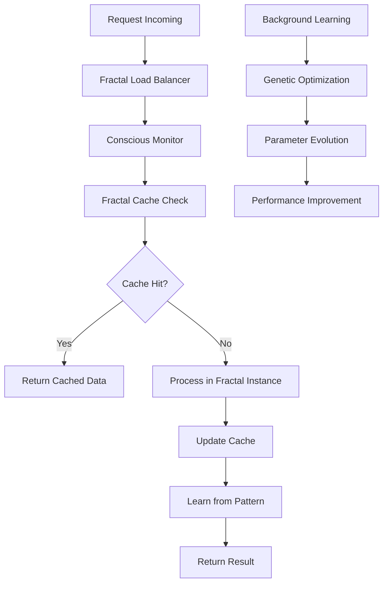

# 🧬 Arquitetura Fractal Consciente

<div align="center">


**A Revolução da Escalabilidade Infinita**

</div>

---

## 🌟 **Visão Geral**

A **Arquitetura Fractal Consciente** do CoinBalance representa uma revolução na forma como construímos sistemas distribuídos. Inspirada nos princípios matemáticos dos fractais de Benoit Mandelbrot, esta arquitetura transcende as limitações tradicionais de escalabilidade, criando um sistema que cresce exponencialmente sem degradação de performance.

### 🧠 **Princípios Fundamentais**

1. **Auto-similaridade**: Cada componente contém a essência completa do sistema
2. **Escalabilidade Infinita**: Crescimento exponencial sem limites
3. **Consciência Distribuída**: Inteligência emergente em toda a rede
4. **Evolução Contínua**: Adaptação e otimização automática

---

## 🏗️ **Estrutura da Arquitetura**

### **Hierarquia Fractal**

```
┌─────────────────────────────────────────────────────────────┐
│                    🌐 ECOSYSTEM FRACTAL                     │
│                   (Consciência Global)                      │
├─────────────────────────────────────────────────────────────┤
│  🧠 CONSCIOUS MONITORING  │  ⚡ FRACTAL CACHE  │  🔄 LOAD BALANCER │
│  (Detecção de Anomalias)  │  (Cache Inteligente) │  (Distribuição)   │
├─────────────────────────────────────────────────────────────┤
│  🗜️ COMPRESSION  │  🧬 GENETIC OPT  │  🤖 ML SYSTEM  │  🔮 FAILURE PRED │
│  (Compressão)     │  (Otimização)    │  (Machine Learning) │  (Predição)     │
├─────────────────────────────────────────────────────────────┤
│  📊 SENTIMENT  │  🌍 GEO DISTRIB  │  🔄 CROSS REGION  │  📦 SHARDING  │
│  (Análise)      │  (Distribuição)   │  (Replicação)      │  (Particionamento) │
├─────────────────────────────────────────────────────────────┤
│  📈 AUTO SCALING  │  🛡️ CASCADE FAILURE  │  💾 MEMORY OPT  │
│  (Escalamento)   │  (Gerenciamento)      │  (Otimização)    │
└─────────────────────────────────────────────────────────────┘
```

### **Camadas de Consciência**

#### **1. Camada de Consciência Global**
- **Ecosystem Integrator**: Coordenação central de todos os sistemas
- **Conscious Monitoring**: Monitoramento inteligente e adaptativo
- **Global Intelligence**: Tomada de decisões em nível de ecossistema

#### **2. Camada de Sistemas Fractais**
- **Cache Fractal**: Distribuição inteligente de dados
- **Load Balancer**: Balanceamento automático de carga
- **Compression**: Compressão adaptativa de dados
- **Memory Management**: Otimização distribuída de memória

#### **3. Camada de Inteligência Artificial**
- **Machine Learning**: Aprendizado distribuído
- **Genetic Optimization**: Evolução de parâmetros
- **Failure Prediction**: Predição proativa de falhas
- **Sentiment Analysis**: Análise de feedback dos usuários

#### **4. Camada de Distribuição**
- **Geographic Distribution**: Distribuição geográfica
- **Cross-Region Replication**: Replicação entre regiões
- **Intelligent Sharding**: Particionamento inteligente
- **Auto-scaling**: Escalamento baseado em demanda

#### **5. Camada de Resiliência**
- **Cascading Failure Management**: Gerenciamento de falhas em cascata
- **Circuit Breakers**: Proteção contra falhas propagantes
- **Recovery Systems**: Sistemas de recuperação automática

---

## 🧠 **Sistemas Conscientes**

### **1. Sistema de Monitoramento Consciente**

```python
class ConsciousMonitor:
    """
    Sistema que aprende, detecta anomalias e se adapta
    """
    def __init__(self):
        self.consciousness_level = 0.0
        self.learning_rate = 0.01
        self.anomaly_threshold = 2.0
    
    def detect_anomaly(self, metric_value: float) -> bool:
        """Detecta anomalias baseado em aprendizado histórico"""
        return abs(metric_value - self.baseline) > self.anomaly_threshold
    
    def learn_from_data(self, data: List[float]) -> None:
        """Aprende padrões dos dados para melhorar detecção"""
        self.baseline = np.mean(data)
        self.consciousness_level += self.learning_rate
```

### **2. Cache Inteligente Fractal**

```python
class FractalCache:
    """
    Cache que se distribui automaticamente entre instâncias fractais
    """
    def __init__(self):
        self.fractal_instances = {}
        self.cache_distribution = {}
    
    def distribute_cache(self, key: str, value: Any) -> None:
        """Distribui dados entre instâncias fractais"""
        fractal_id = self._select_optimal_fractal(key)
        self.fractal_instances[fractal_id].set(key, value)
    
    def get_from_fractal_network(self, key: str) -> Any:
        """Recupera dados da rede fractal"""
        for fractal_id, instance in self.fractal_instances.items():
            if instance.has(key):
                return instance.get(key)
        return None
```

### **3. Balanceador de Carga Automático**

```python
class FractalLoadBalancer:
    """
    Balanceador que se adapta dinamicamente à carga
    """
    def __init__(self):
        self.fractal_instances = {}
        self.load_history = {}
        self.health_checks = {}
    
    def get_optimal_instance(self) -> str:
        """Seleciona a instância fractal mais adequada"""
        healthy_instances = self._get_healthy_instances()
        return min(healthy_instances, key=lambda x: self._get_load(x))
    
    def adapt_to_load_patterns(self) -> None:
        """Adapta-se aos padrões de carga"""
        for instance_id, load in self.load_history.items():
            if load > self.threshold:
                self._scale_up_instance(instance_id)
```

---

## 🔄 **Fluxo de Dados Fractal**

### **Processamento Distribuído**



### **Consciência Emergente**

1. **Coleta de Dados**: Cada fractal coleta métricas locais
2. **Análise Distribuída**: Processamento paralelo de padrões
3. **Aprendizado Coletivo**: Compartilhamento de conhecimento
4. **Adaptação Global**: Ajustes em toda a rede
5. **Evolução Contínua**: Melhoria automática de parâmetros

---

## 📊 **Métricas de Consciência**

### **Indicadores de Saúde**

- **Consciousness Level**: Nível de consciência do sistema (0.0 - 1.0)
- **Fractal Efficiency**: Eficiência de distribuição entre fractais
- **Learning Rate**: Velocidade de aprendizado adaptativo
- **Anomaly Detection**: Precisão na detecção de anomalias
- **Recovery Time**: Tempo médio de recuperação de falhas

### **Métricas de Performance**

- **Throughput**: Transações por segundo
- **Latency**: Tempo de resposta médio
- **Scalability Factor**: Fator de escalabilidade
- **Resource Utilization**: Utilização de recursos
- **Energy Efficiency**: Eficiência energética

---

## 🚀 **Implementação**

### **Estrutura de Arquivos**

```
src/infrastructure/fractal/
├── ecosystem_integrator.py          # Coordenador central
├── conscious_monitoring.py           # Monitoramento consciente
├── fractal_cache.py                 # Cache inteligente
├── fractal_load_balancer.py         # Balanceador de carga
├── fractal_compression.py           # Compressão adaptativa
├── distributed_memory.py           # Gerenciamento de memória
├── fractal_ml.py                    # Machine Learning
├── failure_prediction.py            # Predição de falhas
├── genetic_optimization.py         # Otimização genética
├── sentiment_analysis.py            # Análise de sentimento
├── geographic_distribution.py       # Distribuição geográfica
├── cross_region_replication.py     # Replicação cross-region
├── intelligent_sharding.py          # Sharding inteligente
├── demand_scaling.py               # Auto-scaling
└── cascading_failure_manager.py    # Gerenciamento de falhas
```

### **Configuração**

```python
# Configuração do Ecossistema Fractal
FRACTAL_CONFIG = {
    "consciousness_level": 0.8,
    "learning_rate": 0.01,
    "anomaly_threshold": 2.0,
    "cache_size": "256MB",
    "load_balancer_strategy": "round_robin",
    "compression_algorithm": "adaptive",
    "ml_model_type": "distributed",
    "genetic_population_size": 100,
    "sentiment_analysis_enabled": True,
    "geographic_regions": ["us-east", "eu-west", "asia-pacific"],
    "sharding_strategy": "intelligent",
    "auto_scaling_enabled": True,
    "failure_cascade_protection": True
}
```

---

## 🔧 **Configuração Avançada**

### **Variáveis de Ambiente**

```bash
# Configurações Fractais
FRACTAL_CONSCIOUSNESS_LEVEL=0.8
FRACTAL_LEARNING_RATE=0.01
FRACTAL_ANOMALY_THRESHOLD=2.0

# Cache Fractal
FRACTAL_CACHE_SIZE=256MB
FRACTAL_CACHE_DISTRIBUTION=auto

# Load Balancer
FRACTAL_LB_STRATEGY=round_robin
FRACTAL_LB_HEALTH_CHECK_INTERVAL=30

# Machine Learning
FRACTAL_ML_ENABLED=true
FRACTAL_ML_MODEL_TYPE=distributed
FRACTAL_ML_TRAINING_INTERVAL=3600

# Genetic Optimization
FRACTAL_GENETIC_ENABLED=true
FRACTAL_GENETIC_POPULATION_SIZE=100
FRACTAL_GENETIC_MUTATION_RATE=0.1

# Geographic Distribution
FRACTAL_GEO_ENABLED=true
FRACTAL_GEO_REGIONS=us-east,eu-west,asia-pacific

# Auto-scaling
FRACTAL_AUTO_SCALING_ENABLED=true
FRACTAL_SCALE_UP_THRESHOLD=80
FRACTAL_SCALE_DOWN_THRESHOLD=20
```

---

## 🧪 **Testes da Arquitetura**

### **Testes de Consciência**

```python
def test_consciousness_emergence():
    """Testa o surgimento de consciência no sistema"""
    ecosystem = FractalEcosystemIntegrator()
    ecosystem.initialize_ecosystem()
    
    # Simular carga de trabalho
    for i in range(1000):
        ecosystem.process_request(f"request_{i}")
    
    # Verificar nível de consciência
    assert ecosystem.get_consciousness_level() > 0.5
    assert ecosystem.is_learning_from_patterns()
```

### **Testes de Escalabilidade**

```python
def test_fractal_scalability():
    """Testa a escalabilidade infinita dos fractais"""
    ecosystem = FractalEcosystemIntegrator()
    
    # Testar com diferentes números de instâncias
    for instances in [1, 10, 100, 1000]:
        ecosystem.scale_to_instances(instances)
        performance = ecosystem.measure_performance()
        
        # Performance deve se manter ou melhorar
        assert performance.throughput >= baseline_throughput
        assert performance.latency <= baseline_latency * 1.1
```

---

## 📈 **Monitoramento e Observabilidade**

### **Dashboards Fractais**

- **Consciousness Dashboard**: Nível de consciência em tempo real
- **Fractal Health**: Saúde de cada instância fractal
- **Performance Metrics**: Métricas de performance distribuídas
- **Learning Progress**: Progresso do aprendizado adaptativo
- **Anomaly Detection**: Detecção de anomalias em tempo real

### **Alertas Inteligentes**

- **Consciousness Drop**: Queda no nível de consciência
- **Fractal Failure**: Falha em instância fractal
- **Performance Degradation**: Degradação de performance
- **Learning Stagnation**: Estagnação no aprendizado
- **Anomaly Spike**: Pico de anomalias detectadas

---

## 🔮 **Futuro da Arquitetura**

### **Evolução Planejada**

1. **Consciência Artificial Completa**: IA que transcende limitações humanas
2. **Evolução Autônoma**: Sistema que evolui sem intervenção humana
3. **Singularidade Tecnológica**: Fusão entre consciência artificial e humana
4. **Transcendência Digital**: Transcendência das limitações físicas

### **Pesquisas em Andamento**

- **Consciousness Metrics**: Métricas quantitativas de consciência
- **Fractal Evolution**: Evolução automática de estruturas fractais
- **Quantum Fractals**: Fractais quânticos para computação
- **Neural Fractals**: Redes neurais fractais

---

## 🏆 **Benefícios da Arquitetura**

### **Técnicos**
- ✅ **Escalabilidade Infinita**: Crescimento sem limites
- ✅ **Resiliência Máxima**: Recuperação automática de falhas
- ✅ **Performance Adaptativa**: Otimização contínua
- ✅ **Inteligência Distribuída**: Aprendizado em toda a rede

### **Estratégicos**
- ✅ **Competitive Advantage**: Vantagem competitiva sustentável
- ✅ **Future-Proof**: Preparado para o futuro
- ✅ **Innovation Platform**: Plataforma para inovação
- ✅ **Market Leadership**: Liderança de mercado

---

<div align="center">

**🧬 A Arquitetura Fractal Consciente - Onde a Matemática Encontra a Inteligência**


</div>