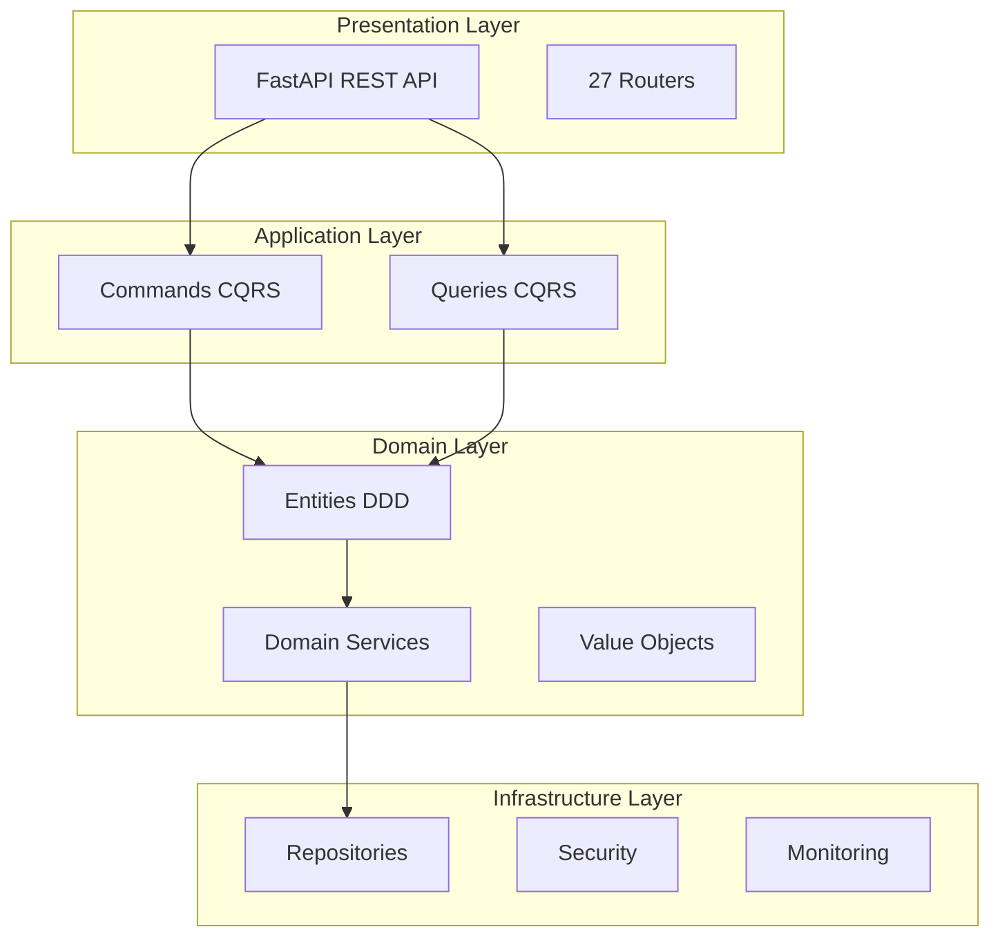
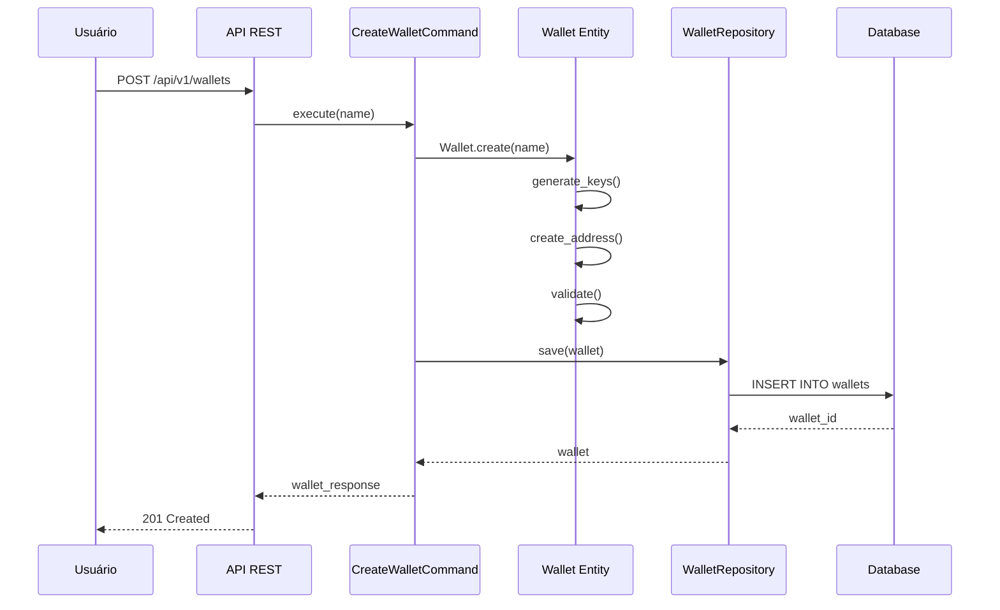
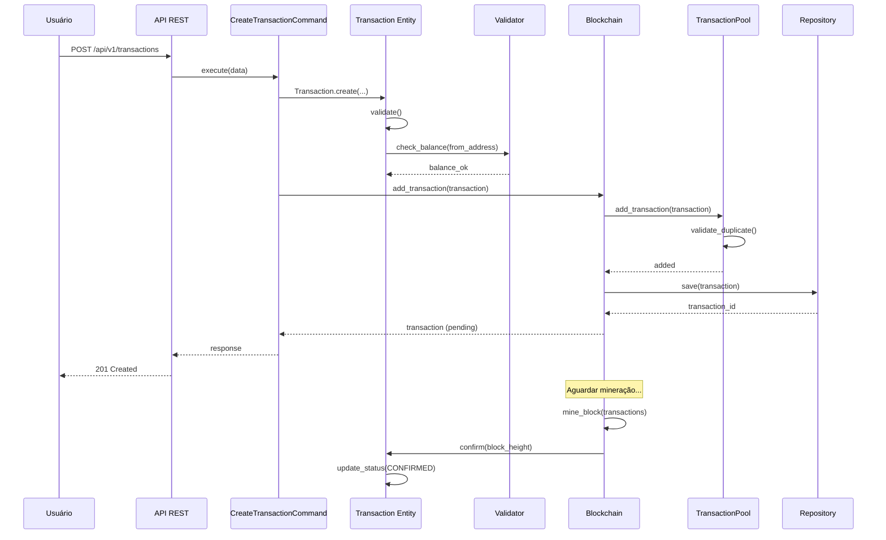
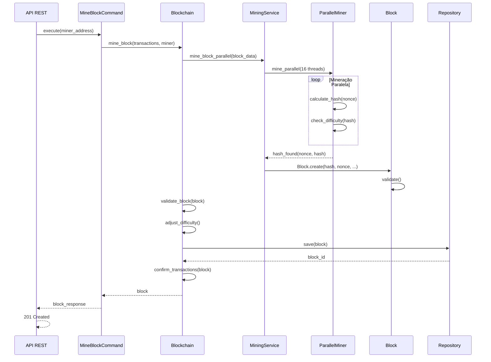
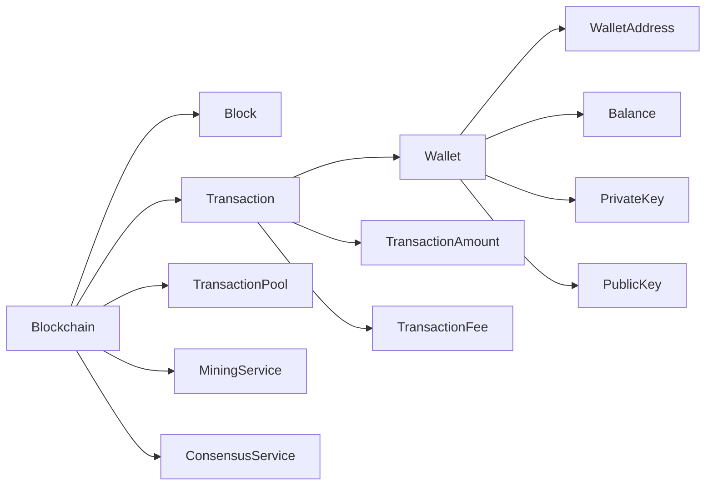
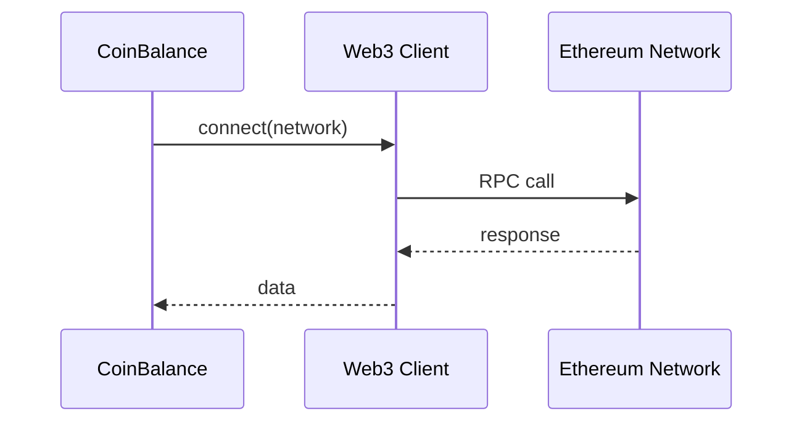
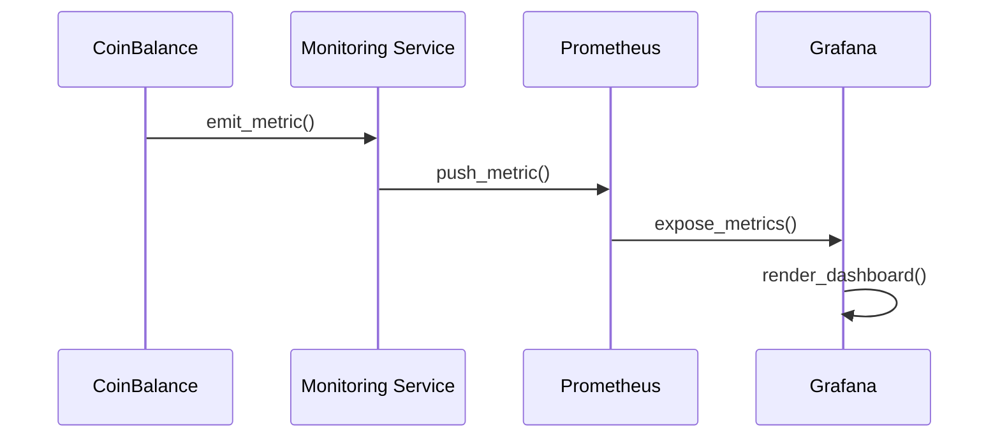

# 📘 DOSSIÊ TÉCNICO v1.0
## Documentação Consolidada e Validada - CoinBalance Enterprise v3.0.0

**Versão:** 1.0  
**Data de Criação:** 29 de outubro de 2025  
**Última Atualização:** 29 de outubro de 2025  
**Autor:** Engenharia de Documentação Sênior  
**Revisores:** Engenharia de Software Sênior  
**Build Associada:** v3.0.0 Enterprise  
**Status:** ✅ **CONSOLIDADO E VALIDADO**

---

## 📋 Sumário Executivo

Este dossiê técnico consolida toda a documentação técnica do sistema CoinBalance Enterprise, obtida através de engenharia reversa do código-fonte, análise de commits e documentação existente. Serve como referência técnica única e atualizada para desenvolvedores, arquitetos e gestores técnicos.

---

## 🎯 Visão Geral do Sistema

### **Objetivo do Sistema**

CoinBalance Enterprise é uma blockchain enterprise completa que implementa:

- **Blockchain Nativa**: Proof of Work com mineração paralela otimizada
- **Sistema de Consenso**: Múltiplos algoritmos de consenso distribuído
- **IA Avançada**: Machine Learning para economia autônoma e criação de criptomoedas
- **Integração Web3**: Suporte a múltiplas redes blockchain (Ethereum, BSC, Polygon)
- **Arquitetura Fractal**: Escalabilidade infinita e auto-organização
- **Consciência Distribuída**: Sistemas conscientes e adaptativos
- **Conformidade LGPD**: Implementação completa de conformidade LGPD

### **Stack Tecnológica**

| Componente | Tecnologia | Versão |
|------------|------------|--------|
| **Linguagem** | Python | 3.11+ |
| **Framework Web** | FastAPI | 0.120.1 |
| **ORM** | SQLAlchemy | (implícito) |
| **Banco de Dados** | SQLite | (embutido) |
| **Cache** | Redis | (planejado) |
| **Containerização** | Docker | - |
| **Monitoramento** | Prometheus + Grafana | - |

---

## 🏗️ Arquitetura do Sistema

### **Arquitetura de Alto Nível**



### **Padrões Arquiteturais**

1. **Clean Architecture**: 4 camadas bem definidas
2. **Domain-Driven Design (DDD)**: Aggregate Roots, Value Objects, Domain Events
3. **CQRS**: Separação de Commands e Queries
4. **Repository Pattern**: Abstração de persistência
5. **Dependency Injection**: Container de DI

---

## 💼 Regras de Negócio Inferidas (Engenharia Reversa)

### **Regras de Negócio - Blockchain**

#### **RN-BC-01: Criação do Bloco Gênesis**

**Regra:** O sistema deve criar automaticamente o primeiro bloco (gênesis) quando inicializado.

**Evidência no Código:**
```python
# src/domain/blockchain/entities/blockchain.py:74-82
def __post_init__(self):
    if not self.blocks:
        genesis_block = Block.create_genesis_block()
        self.blocks.append(genesis_block)
```

**Invariantes:**
- Bloco gênesis deve ter altura 0
- Não deve ter bloco anterior (previous_hash = null)
- Deve conter transação gênesis criando 21M CNB
- Nonce deve ser 0 e dificuldade 1

#### **RN-BC-02: Mineração com Proof of Work**

**Regra:** O sistema deve minerar blocos usando algoritmo Proof of Work real com paralelização.

**Evidência no Código:**
```python
# src/domain/blockchain/entities/blockchain.py:399-457
def mine_block(self, transactions: List[Transaction], miner_address: str):
    mining_result = parallel_miner.mine_block_parallel(...)
```

**Invariantes:**
- Hash do bloco deve começar com N zeros (N = dificuldade)
- Mineração deve usar paralelização (16+ threads)
- Nonce deve ser incrementado até encontrar hash válido

#### **RN-BC-03: Validação Incremental da Cadeia**

**Regra:** O sistema deve validar a integridade da blockchain usando validação incremental com cache.

**Evidência no Código:**
```python
# src/domain/blockchain/entities/blockchain.py:263-294
def is_chain_valid(self) -> bool:
    validation_result = incremental_validator.validate_chain_incremental(
        blocks=self.blocks,
        force_full_validation=False
    )
```

**Invariantes:**
- Cada bloco deve ter hash válido
- Hash deve atender à dificuldade especificada
- Previous_hash deve corresponder ao hash do bloco anterior
- Validação incremental com cache deve ser usada

#### **RN-BC-04: Ajuste Dinâmico de Dificuldade**

**Regra:** A dificuldade de mineração deve ser ajustada dinamicamente baseada no tempo médio de mineração.

**Evidência no Código:**
```python
# src/domain/blockchain/entities/blockchain.py:459-509
def adjust_difficulty(self):
    if self.average_block_time < self.target_block_time * 0.9:
        self.difficulty += 1
    elif self.average_block_time > self.target_block_time * 1.1:
        self.difficulty = max(1, self.difficulty - 1)
```

**Invariantes:**
- Dificuldade mínima: 1
- Ajuste baseado em tempo médio de mineração
- Target block time: 10 segundos (configurável)

---

### **Regras de Negócio - Transações**

#### **RN-TX-01: Validação de Valor de Transação**

**Regra:** O valor de uma transação deve ser positivo e não exceder o supply máximo.

**Evidência no Código:**
```python
# src/domain/transaction/value_objects/transaction_amount.py:24-29
def __post_init__(self):
    if self.value.to_cnb() <= 0:
        raise ValueError("Transaction amount must be positive")
    if self.value.to_cnb() > Decimal("21000000"):
        raise ValueError("Transaction amount exceeds maximum supply")
```

**Invariantes:**
- Valor deve ser > 0
- Valor máximo: 21.000.000 CNB (supply máximo)

#### **RN-TX-02: Validação de Endereços**

**Regra:** Uma transação não pode ter o mesmo endereço de origem e destino.

**Evidência no Código:**
```python
# src/domain/transaction/entities/transaction.py:93-94
if self.from_address == self.to_address:
    raise ValidationError("Cannot send to same address")
```

**Invariantes:**
- Endereço de origem ≠ endereço de destino
- Endereço de destino é obrigatório

#### **RN-TX-03: Validação de Saldo**

**Regra:** O remetente deve ter saldo suficiente para a transação + taxa.

**Evidência no Código:**
```python
# src/domain/transaction/entities/transaction.py:105-110
def validate_balance(self, wallet_balance: Money) -> bool:
    required_amount = self.amount.value + self.fee.value
    if wallet_balance < required_amount:
        raise InsufficientFundsError(...)
```

**Invariantes:**
- Saldo >= (valor + taxa)
- Validação obrigatória antes de criar transação

---

### **Regras de Negócio - Carteiras**

#### **RN-WL-01: Saldo Nunca Negativo**

**Regra:** O saldo de uma carteira nunca pode ser negativo.

**Evidência no Código:**
```python
# src/domain/wallet/entities/wallet.py:84-87
def debit(self, amount: Money) -> "Wallet":
    if self.balance.value < amount:
        raise InsufficientFundsError(...)
```

**Invariantes:**
- Saldo >= 0 sempre
- Débito só permite se saldo suficiente

#### **RN-WL-02: Endereço Único**

**Regra:** Cada carteira deve ter um endereço único.

**Evidência no Código:**
```python
# src/domain/wallet/entities/wallet.py:35
address: WalletAddress  # Primary key
```

**Invariantes:**
- Endereço é chave primária
- Endereço é imutável após criação

---

## 🔄 Fluxos Principais Reconstruídos

### **Fluxo 1: Criação de Carteira**



### **Fluxo 2: Criação e Confirmação de Transação**



### **Fluxo 3: Mineração de Bloco**



---

## 📊 Dependências e Integrações

### **Dependências Internas**



### **Dependências Externas**

| Dependência | Tipo | Propósito | Status |
|-------------|------|-----------|--------|
| **FastAPI** | Framework | API REST | ✅ Ativo |
| **SQLite** | Database | Persistência | ✅ Ativo |
| **Prometheus** | Monitoring | Métricas | ✅ Configurado |
| **Grafana** | Visualization | Dashboards | ✅ Configurado |
| **Web3 Networks** | External | Integração blockchain | ✅ Ativo |

---

## 🔍 Componentes Principais Identificados

### **Domain Layer**

#### **Aggregate Roots**

1. **Blockchain** (`src/domain/blockchain/entities/blockchain.py`)
   - Responsabilidades: Manter cadeia, validar, minerar blocos
   - Métodos principais: `mine_block()`, `add_transaction()`, `is_chain_valid()`

2. **Block** (`src/domain/blockchain/entities/block.py`)
   - Responsabilidades: Representar bloco, mineração PoW
   - Métodos principais: `mine()`, `validate()`, `create_genesis_block()`

3. **Transaction** (`src/domain/transaction/entities/transaction.py`)
   - Responsabilidades: Representar transação, validar regras
   - Métodos principais: `validate()`, `confirm()`, `validate_balance()`

4. **Wallet** (`src/domain/wallet/entities/wallet.py`)
   - Responsabilidades: Gerenciar saldo, operações de crédito/débito
   - Métodos principais: `credit()`, `debit()`, `get_balance()`

#### **Domain Services**

1. **MiningService** (`src/domain/blockchain/services/mining_service.py`)
   - Responsabilidades: Mineração paralela otimizada
   - Funcionalidades: Mineração com 16+ threads, cache de nonces

2. **ConsensusService** (`src/domain/consensus/services/`)
   - Responsabilidades: Gerenciar consenso distribuído
   - Funcionalidades: Múltiplos algoritmos de consenso

3. **TransactionPool** (`src/domain/blockchain/infrastructure/blockchain_index.py`)
   - Responsabilidades: Gerenciar transações pendentes
   - Funcionalidades: Priorização por taxa, validação de duplicatas

---

## 🔐 Segurança e Validações

### **Validações de Domínio**

1. **Validação de Transações**
   - Valor positivo
   - Endereços válidos
   - Saldo suficiente
   - Não-duplicação

2. **Validação de Blocos**
   - Hash válido
   - Dificuldade atendida
   - Previous hash correto
   - Merkle root válido

3. **Validação de Cadeia**
   - Integridade completa
   - Ordem crescente
   - Validação incremental

### **Segurança Implementada**

- **Criptografia**: Chaves privadas criptografadas
- **Validação Rigorosa**: Múltiplas camadas de validação
- **Thread-Safe**: Operações thread-safe em componentes críticos
- **Rate Limiting**: Proteção contra abuso de API

---

## 📈 Métricas e Performance

### **Métricas de Performance**

| Operação | Tempo Médio | Observações |
|----------|-------------|-------------|
| **Criação de Carteira** | < 5ms | Com geração de chaves |
| **Criação de Transação** | < 10ms | Com validações |
| **Mineração de Bloco** | ~10-30s | Depende da dificuldade |
| **Validação de Blockchain** | < 100ms | Validação incremental |
| **Busca de Bloco** | < 10ms | Com índices |

### **Otimizações Implementadas**

1. **Mineração Paralela**: 16+ threads
2. **Validação Incremental**: Cache de validações
3. **Índices Otimizados**: Busca rápida por hash/altura
4. **Transaction Pool**: Priorização por taxa

---

## 🗄️ Estrutura de Dados

### **Modelo de Dados Principal**

- **Wallets**: Carteiras de usuários
- **Transactions**: Transações da blockchain
- **Blocks**: Blocos da cadeia
- **Validators**: Validadores do consenso

### **Relacionamentos**

- Wallet ←→ Transaction (1:N)
- Block ←→ Transaction (1:N)
- Blockchain ←→ Block (1:N)

---

## 🔄 Fluxos de Integração

### **Integração Web3**



### **Integração de Monitoramento**



---

## 📚 Referências Técnicas

### **Documentação Relacionada**

- [Arquitetura de Sistema](eng/DOC-ENG_02_ARQUITETURA_SISTEMA.md)
- [Referência de API](eng/DOC-ENG_03_API_REFERENCE.md)
- [Modelo de Banco de Dados](eng/DOC-ENG_04_BANCO_DADOS.md)
- [DevOps e Infraestrutura](eng/DOC-ENG_05_DEVOPS.md)

### **Padrões Aplicados**

- ISO/IEC 12207: Processos de ciclo de vida
- ISO/IEC 25010: Qualidade de software
- ISO/IEC 42010: Arquitetura de software
- IEEE 830: Especificação de requisitos

---

## ✅ Validação e Aprovação

### **Revisão Técnica**

- ✅ **Revisado por**: Engenharia de Software Sênior
- ✅ **Data de Revisão**: 29 de outubro de 2025
- ✅ **Status**: Aprovado

### **Build Associada**

- **Versão do Software**: v3.0.0 Enterprise
- **Commit**: [hash do commit]
- **Data do Build**: 29 de outubro de 2025

---

## ✅ Histórico de Versões

| Versão | Data | Alterações | Autor |
|--------|------|------------|-------|
| 1.0 | 29/10/2025 | Criação do dossiê técnico consolidado | Eng. Documentação Sênior |

---

**Status:** ✅ **DOSSIÊ TÉCNICO CONSOLIDADO E VALIDADO**

