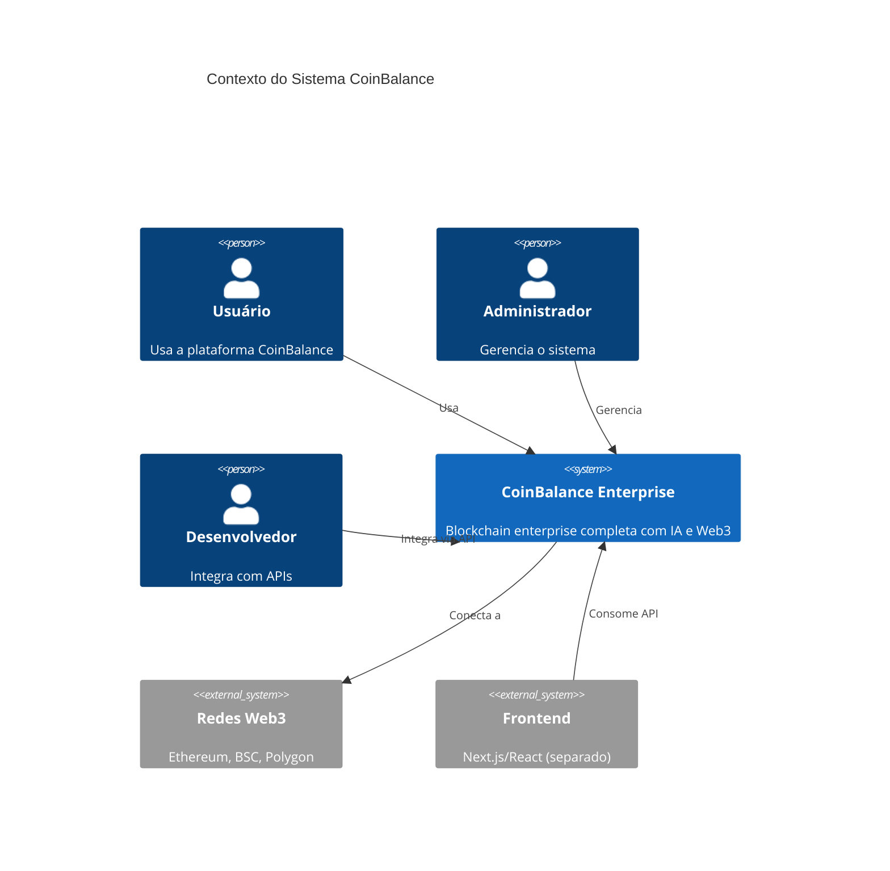
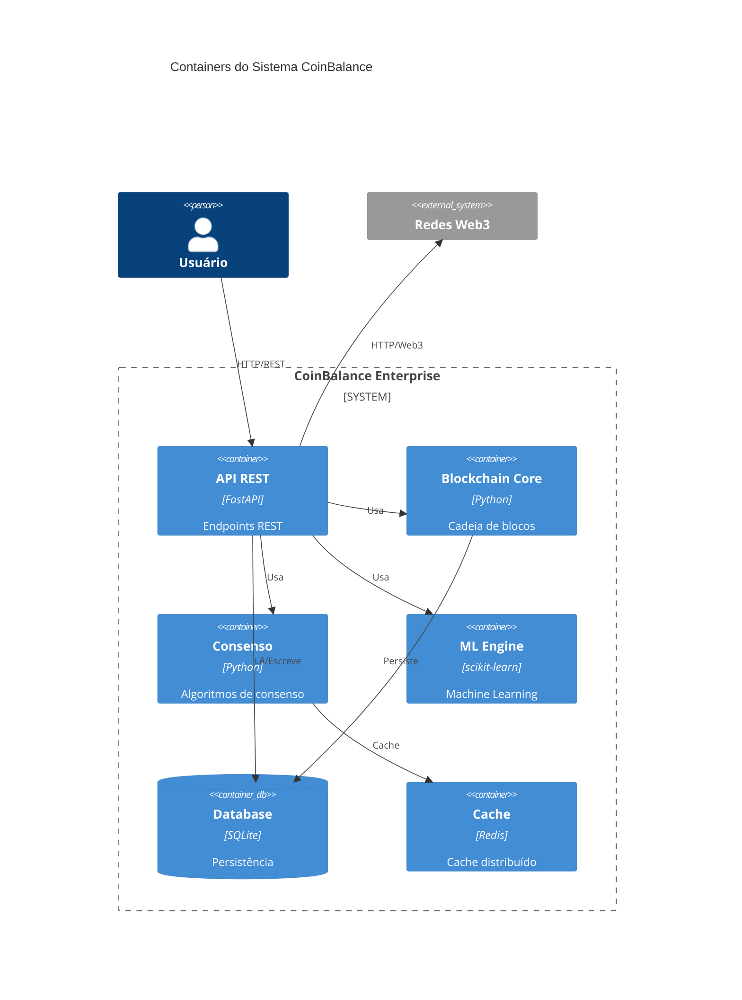
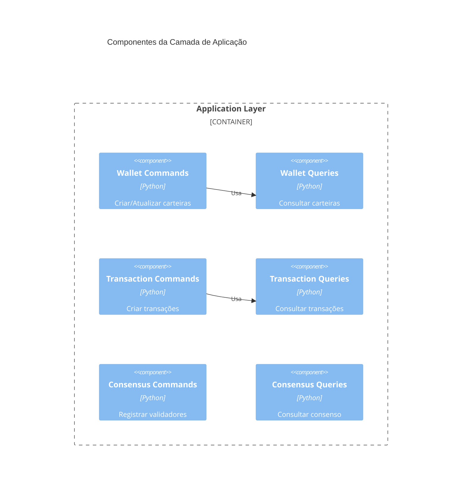
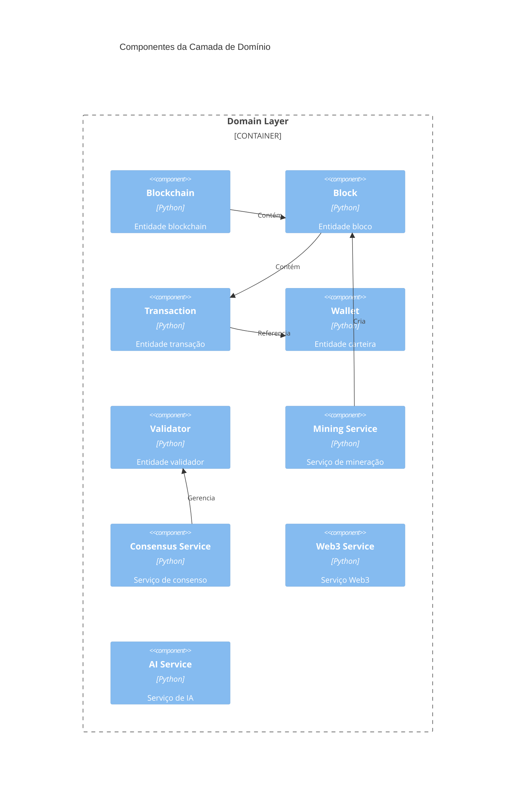
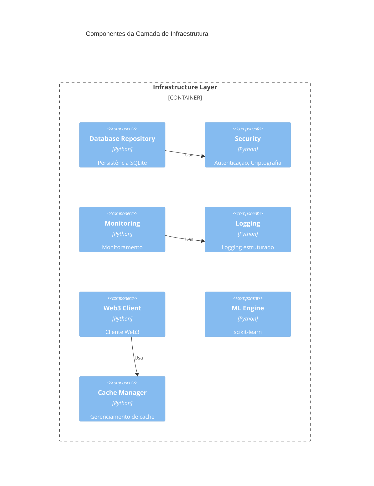
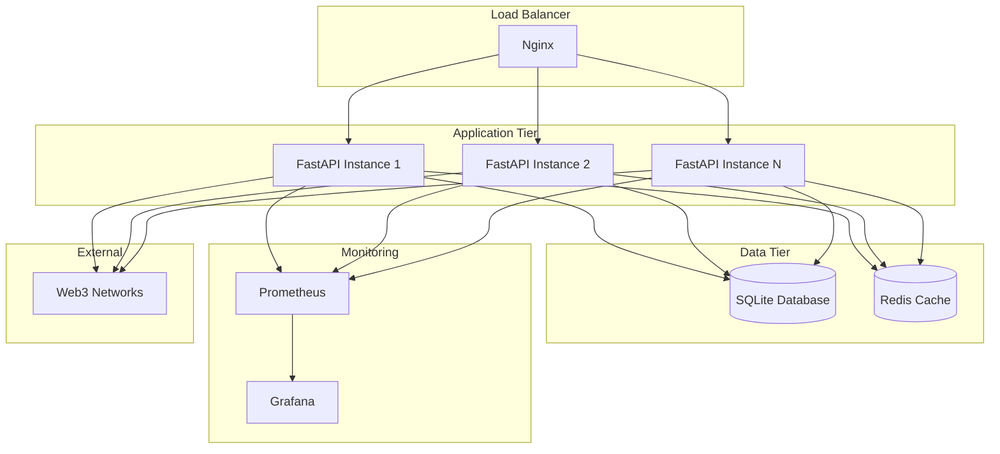
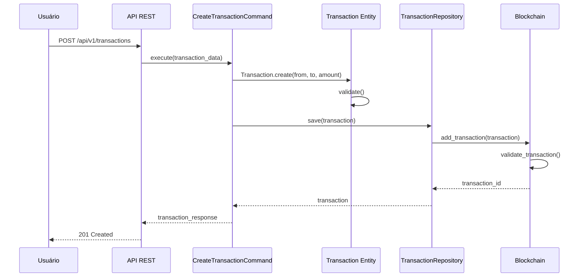
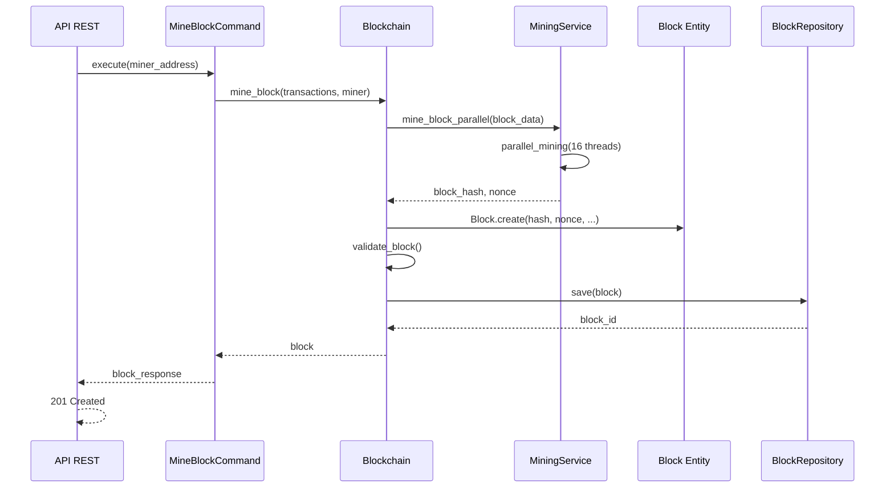

# 🗺️ DOC-ENG_02_ARQUITETURA_SISTEMA
## Arquitetura de Sistema - CoinBalance Enterprise v3.0.0

**Versão:** 1.0  
**Data de Criação:** 29 de outubro de 2025  
**Última Atualização:** 29 de outubro de 2025  
**Autor:** Engenharia de Documentação Sênior  
**Status:** ✅ **COMPLETO**

---

## 📋 Sumário Executivo

Este documento apresenta a arquitetura completa do sistema CoinBalance Enterprise v3.0.0, incluindo arquitetura lógica (C4 Model), arquitetura física, diagramas de componentes, padrões arquiteturais e decisões de design.

---

## 🎯 Visão Geral do Sistema

### **Objetivos do Sistema**

CoinBalance é uma blockchain enterprise completa que implementa:

- **Blockchain Nativa**: Proof of Work com mineração paralela
- **Sistema de Consenso**: Múltiplos algoritmos de consenso distribuído
- **IA Avançada**: Machine Learning para economia autônoma
- **Integração Web3**: Suporte a múltiplas redes blockchain
- **Arquitetura Fractal**: Escalabilidade infinita e auto-organização
- **Consciência Distribuída**: Sistemas conscientes e adaptativos

### **Stack Tecnológica**

| Camada | Tecnologia | Versão |
|--------|------------|--------|
| **Linguagem** | Python | 3.11+ |
| **Framework Web** | FastAPI | 0.120.1 |
| **ORM** | SQLAlchemy | (implícito) |
| **Banco de Dados** | SQLite | (embutido) |
| **Cache** | Redis | (planejado) |
| **Containerização** | Docker | - |
| **Monitoramento** | Prometheus + Grafana | - |

---

## 🏗️ Arquitetura Lógica (C4 Model)

### **C1: Contexto do Sistema**



### **C2: Containers**



### **C3: Componentes - Camada de Apresentação**

```mermaid
C4Component
    title Componentes da Camada de Apresentação

    Container(api, "API REST", "FastAPI")
    
    Component_Boundary(presentation, "Presentation Layer") {
        Component(wallet_router, "Wallet Router", "Python", "Endpoints de carteiras")
        Component(blockchain_router, "Blockchain Router", "Python", "Endpoints de blockchain")
        Component(transaction_router, "Transaction Router", "Python", "Endpoints de transações")
        Component(consensus_router, "Consensus Router", "Python", "Endpoints de consenso")
        Component(web3_router, "Web3 Router", "Python", "Endpoints Web3")
        Component(monitoring_router, "Monitoring Router", "Python", "Endpoints de monitoramento")
        Component(auth_router, "Auth Router", "Python", "Autenticação")
        Component(middleware, "Middleware", "Python", "Validação, CORS, Rate Limiting")
    }
    
    Rel(api, middleware, "Usa")
    Rel(middleware, wallet_router, "Roteia")
    Rel(middleware, blockchain_router, "Roteia")
    Rel(middleware, transaction_router, "Roteia")
    Rel(middleware, consensus_router, "Roteia")
    Rel(middleware, web3_router, "Roteia")
    Rel(middleware, monitoring_router, "Roteia")
    Rel(middleware, auth_router, "Roteia")
```

### **C3: Componentes - Camada de Aplicação**



### **C3: Componentes - Camada de Domínio**



### **C3: Componentes - Camada de Infraestrutura**



---

## 🏛️ Arquitetura Física

### **Deploy em Produção**



---

## 🔄 Padrões Arquiteturais Utilizados

### **1. Clean Architecture**

```
┌─────────────────────────────────────────┐
│         Presentation Layer              │  FastAPI, Routers, Schemas
│         (Frameworks & Drivers)          │
├─────────────────────────────────────────┤
│         Application Layer               │  Use Cases, Commands, Queries
│         (Application Business Rules)   │
├─────────────────────────────────────────┤
│         Domain Layer (Core)             │  Entities, Value Objects, Events
│         (Enterprise Business Rules)     │
├─────────────────────────────────────────┤
│         Infrastructure Layer            │  DB, Security, Web3, AI, Monitoring
│         (Interface Adapters)           │
└─────────────────────────────────────────┘
```

**Benefícios:**
- ✅ Independência de frameworks
- ✅ Testabilidade
- ✅ Independência de UI
- ✅ Independência de banco de dados
- ✅ Independência de agentes externos

### **2. Domain-Driven Design (DDD)**

#### **Aggregate Roots**
- `Blockchain` - Agregado raiz da blockchain
- `Block` - Agregado raiz de blocos
- `Transaction` - Agregado raiz de transações
- `Wallet` - Agregado raiz de carteiras
- `Validator` - Agregado raiz de validadores

#### **Value Objects**
- `Money` - Representação monetária
- `HashValue` - Valor de hash
- `Timestamp` - Timestamp
- `WalletAddress` - Endereço de carteira
- `TransactionAmount` - Valor de transação

#### **Domain Events**
- `TransactionCreated`
- `TransactionConfirmed`
- `WalletCreated`
- `BlockMined`
- `ValidatorRegistered`

### **3. CQRS (Command Query Responsibility Segregation)**

**Commands (Escrita):**
- `CreateWalletCommand`
- `CreateTransferCommand`
- `RegisterValidatorCommand`
- `MineBlockCommand`

**Queries (Leitura):**
- `GetWalletQuery`
- `GetTransactionQuery`
- `GetBlockchainStatsQuery`
- `GetValidatorListQuery`

### **4. Repository Pattern**

```python
# Interface
class WalletRepository(ABC):
    @abstractmethod
    async def create(self, wallet: Wallet) -> Wallet:
        pass
    
    @abstractmethod
    async def get_by_address(self, address: str) -> Optional[Wallet]:
        pass

# Implementação
class SQLiteWalletRepository(WalletRepository):
    def __init__(self, db_manager: DatabaseManager):
        self.db = db_manager
```

### **5. Dependency Injection**

```python
# Container de DI
container = Container()

# Registrar dependências
container.register(WalletRepository, SQLiteWalletRepository)
container.register(BlockchainService, BlockchainServiceImpl)

# Resolver dependências
wallet_repo = container.resolve(WalletRepository)
```

---

## 📊 Diagramas de Sequência

### **Criação de Transação**



### **Mineração de Bloco**



---

## 🔐 Segurança Arquitetural

### **Camadas de Segurança**

1. **Camada de Apresentação**
   - Rate Limiting
   - Validação de entrada
   - CORS
   - Autenticação JWT

2. **Camada de Aplicação**
   - Autorização baseada em roles
   - Validação de regras de negócio

3. **Camada de Domínio**
   - Invariantes de domínio
   - Validação de entidades

4. **Camada de Infraestrutura**
   - Criptografia de dados sensíveis
   - Logging de segurança
   - Monitoramento de ameaças

---

## 📈 Escalabilidade

### **Estratégias de Escalabilidade**

1. **Escalabilidade Horizontal**
   - Múltiplas instâncias FastAPI
   - Load balancer (Nginx)
   - Cache distribuído (Redis)

2. **Escalabilidade Vertical**
   - Mineração paralela (16+ threads)
   - Validação incremental com cache
   - Otimização de queries

3. **Arquitetura Fractal**
   - Auto-organização
   - Escalabilidade infinita
   - Sharding inteligente

---

## ✅ Histórico de Versões

| Versão | Data | Alterações | Autor |
|--------|------|------------|-------|
| 1.0 | 29/10/2025 | Criação da documentação de arquitetura | Eng. Documentação Sênior |

---

**Status:** ✅ **FASE 3 PARCIAL - ARQUITETURA DOCUMENTADA**

