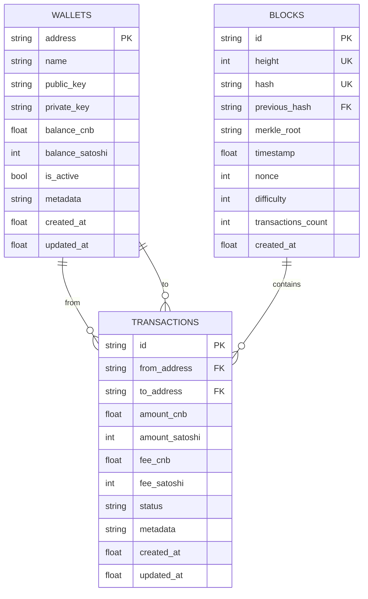

# 🗄️ DOC-ENG_04_BANCO_DADOS
## Modelo de Dados e Banco de Dados - CoinBalance Enterprise v3.0.0

**Versão:** 1.0  
**Data de Criação:** 29 de outubro de 2025  
**Última Atualização:** 29 de outubro de 2025  
**Autor:** Engenharia de Documentação Sênior  
**Status:** ✅ **COMPLETO**

---

## 📋 Sumário Executivo

Este documento descreve o modelo de dados completo do sistema CoinBalance Enterprise, incluindo esquema de tabelas, relacionamentos, índices, migrações e estratégias de backup e recuperação.

---

## 🗄️ Tecnologia de Banco de Dados

### **Sistema de Gerenciamento**

| Aspecto | Detalhe |
|---------|---------|
| **SGBD** | SQLite 3 |
| **Motivo** | Leve, embutido, adequado para blockchain |
| **Arquivo** | `blockchain.db` |
| **Localização** | Raiz do projeto |
| **Thread-Safe** | ✅ Sim (threading.local) |

---

## 📊 Modelo de Dados

### **Diagrama ER Simplificado**



---

## 📋 Esquema de Tabelas

### **1. Tabela: wallets**

**Descrição:** Armazena informações de carteiras de usuários.

**Estrutura:**

```sql
CREATE TABLE wallets (
    address TEXT PRIMARY KEY CHECK(length(address) >= 26 AND length(address) <= 62),
    name TEXT NOT NULL UNIQUE CHECK(length(name) >= 3 AND length(name) <= 50),
    public_key TEXT NOT NULL CHECK(length(public_key) >= 32),
    private_key TEXT NOT NULL CHECK(length(private_key) >= 32),
    balance_cnb REAL NOT NULL DEFAULT 0.0 CHECK(balance_cnb >= 0),
    balance_satoshi INTEGER NOT NULL DEFAULT 0 CHECK(balance_satoshi >= 0),
    is_active BOOLEAN NOT NULL DEFAULT 1,
    metadata TEXT,
    created_at REAL NOT NULL CHECK(created_at > 0),
    updated_at REAL NOT NULL CHECK(updated_at >= created_at)
);
```

**Campos:**

| Campo | Tipo | Descrição | Constraints |
|-------|------|-----------|-------------|
| `address` | TEXT | Endereço único da carteira | PK, CHECK(length) |
| `name` | TEXT | Nome da carteira | NOT NULL, UNIQUE, CHECK(length) |
| `public_key` | TEXT | Chave pública | NOT NULL, CHECK(length) |
| `private_key` | TEXT | Chave privada (criptografada) | NOT NULL, CHECK(length) |
| `balance_cnb` | REAL | Saldo em CNB | NOT NULL, DEFAULT 0, CHECK(>= 0) |
| `balance_satoshi` | INTEGER | Saldo em satoshis | NOT NULL, DEFAULT 0, CHECK(>= 0) |
| `is_active` | BOOLEAN | Status ativo/inativo | NOT NULL, DEFAULT 1 |
| `metadata` | TEXT | Metadados adicionais (JSON) | NULL |
| `created_at` | REAL | Timestamp de criação | NOT NULL, CHECK(> 0) |
| `updated_at` | REAL | Timestamp de atualização | NOT NULL, CHECK(>= created_at) |

**Índices:**

```sql
CREATE INDEX idx_wallets_name ON wallets(name);
CREATE INDEX idx_wallets_active ON wallets(is_active);
```

---

### **2. Tabela: transactions**

**Descrição:** Armazena todas as transações do sistema.

**Estrutura:**

```sql
CREATE TABLE transactions (
    id TEXT PRIMARY KEY CHECK(length(id) >= 16),
    from_address TEXT CHECK(length(from_address) >= 26 AND length(from_address) <= 62),
    to_address TEXT NOT NULL CHECK(length(to_address) >= 26 AND length(to_address) <= 62),
    amount_cnb REAL NOT NULL CHECK(amount_cnb > 0),
    amount_satoshi INTEGER NOT NULL CHECK(amount_satoshi > 0),
    fee_cnb REAL NOT NULL DEFAULT 0.0 CHECK(fee_cnb >= 0),
    fee_satoshi INTEGER NOT NULL DEFAULT 0 CHECK(fee_satoshi >= 0),
    status TEXT NOT NULL DEFAULT 'pending' CHECK(status IN ('pending', 'confirmed', 'failed')),
    metadata TEXT,
    created_at REAL NOT NULL CHECK(created_at > 0),
    updated_at REAL NOT NULL CHECK(updated_at >= created_at),
    FOREIGN KEY (from_address) REFERENCES wallets (address) ON DELETE SET NULL,
    FOREIGN KEY (to_address) REFERENCES wallets (address) ON DELETE RESTRICT
);
```

**Campos:**

| Campo | Tipo | Descrição | Constraints |
|-------|------|-----------|-------------|
| `id` | TEXT | ID único da transação | PK, CHECK(length) |
| `from_address` | TEXT | Endereço origem | FK -> wallets, CHECK(length) |
| `to_address` | TEXT | Endereço destino | NOT NULL, FK -> wallets, CHECK(length) |
| `amount_cnb` | REAL | Valor em CNB | NOT NULL, CHECK(> 0) |
| `amount_satoshi` | INTEGER | Valor em satoshis | NOT NULL, CHECK(> 0) |
| `fee_cnb` | REAL | Taxa em CNB | NOT NULL, DEFAULT 0, CHECK(>= 0) |
| `fee_satoshi` | INTEGER | Taxa em satoshis | NOT NULL, DEFAULT 0, CHECK(>= 0) |
| `status` | TEXT | Status da transação | NOT NULL, DEFAULT 'pending', CHECK(IN) |
| `metadata` | TEXT | Metadados (JSON) | NULL |
| `created_at` | REAL | Timestamp de criação | NOT NULL, CHECK(> 0) |
| `updated_at` | REAL | Timestamp de atualização | NOT NULL, CHECK(>= created_at) |

**Índices:**

```sql
CREATE INDEX idx_transactions_from ON transactions(from_address);
CREATE INDEX idx_transactions_to ON transactions(to_address);
CREATE INDEX idx_transactions_status ON transactions(status);
CREATE INDEX idx_transactions_created ON transactions(created_at);
```

**Relacionamentos:**
- `from_address` → `wallets.address` (ON DELETE SET NULL)
- `to_address` → `wallets.address` (ON DELETE RESTRICT)

---

### **3. Tabela: blocks**

**Descrição:** Armazena os blocos da blockchain.

**Estrutura:**

```sql
CREATE TABLE blocks (
    id TEXT PRIMARY KEY CHECK(length(id) >= 16),
    height INTEGER NOT NULL UNIQUE CHECK(height >= 0),
    hash TEXT NOT NULL UNIQUE CHECK(length(hash) = 64),
    previous_hash TEXT CHECK(length(previous_hash) = 64),
    merkle_root TEXT NOT NULL CHECK(length(merkle_root) = 64),
    timestamp REAL NOT NULL CHECK(timestamp > 0),
    nonce INTEGER NOT NULL DEFAULT 0 CHECK(nonce >= 0),
    difficulty INTEGER NOT NULL DEFAULT 1 CHECK(difficulty > 0),
    transactions_count INTEGER NOT NULL DEFAULT 0 CHECK(transactions_count >= 0),
    created_at REAL NOT NULL CHECK(created_at > 0)
);
```

**Campos:**

| Campo | Tipo | Descrição | Constraints |
|-------|------|-----------|-------------|
| `id` | TEXT | ID único do bloco | PK, CHECK(length) |
| `height` | INTEGER | Altura do bloco | NOT NULL, UNIQUE, CHECK(>= 0) |
| `hash` | TEXT | Hash SHA-256 do bloco | NOT NULL, UNIQUE, CHECK(length = 64) |
| `previous_hash` | TEXT | Hash do bloco anterior | CHECK(length = 64) |
| `merkle_root` | TEXT | Raiz da árvore Merkle | NOT NULL, CHECK(length = 64) |
| `timestamp` | REAL | Timestamp Unix | NOT NULL, CHECK(> 0) |
| `nonce` | INTEGER | Nonce usado na mineração | NOT NULL, DEFAULT 0, CHECK(>= 0) |
| `difficulty` | INTEGER | Dificuldade de mineração | NOT NULL, DEFAULT 1, CHECK(> 0) |
| `transactions_count` | INTEGER | Número de transações | NOT NULL, DEFAULT 0, CHECK(>= 0) |
| `created_at` | REAL | Timestamp de criação | NOT NULL, CHECK(> 0) |

**Índices:**

```sql
CREATE INDEX idx_blocks_height ON blocks(height);
CREATE INDEX idx_blocks_hash ON blocks(hash);
CREATE INDEX idx_blocks_previous_hash ON blocks(previous_hash);
```

---

## 🔗 Relacionamentos

### **Relacionamentos Principais**

1. **Wallets ↔ Transactions**
   - Uma carteira pode ter múltiplas transações (origem ou destino)
   - Relacionamento 1:N (um-para-muitos)

2. **Blocks ↔ Transactions**
   - Um bloco contém múltiplas transações
   - Relacionamento 1:N (um-para-muitos)
   - Implementado via `merkle_root` e lógica de aplicação

3. **Blocks ↔ Blocks**
   - Um bloco referencia o bloco anterior
   - Relacionamento 1:1 (previous_hash)

---

## 📊 Índices e Otimizações

### **Índices Criados**

#### **Tabela wallets:**
- `idx_wallets_name` - Busca por nome
- `idx_wallets_active` - Filtro por status ativo

#### **Tabela transactions:**
- `idx_transactions_from` - Busca por endereço origem
- `idx_transactions_to` - Busca por endereço destino
- `idx_transactions_status` - Filtro por status
- `idx_transactions_created` - Ordenação por data

#### **Tabela blocks:**
- `idx_blocks_height` - Busca por altura
- `idx_blocks_hash` - Busca por hash (único)
- `idx_blocks_previous_hash` - Cadeia de blocos

### **Otimizações Aplicadas**

1. **Constraints de Integridade**
   - CHECK constraints em todos os campos críticos
   - FOREIGN KEY constraints para integridade referencial
   - UNIQUE constraints em campos únicos

2. **Índices Estratégicos**
   - Índices em campos frequentemente consultados
   - Índices compostos quando necessário

3. **Validação no Banco**
   - Constraints garantem integridade mesmo com acesso direto ao banco

---

## 🔄 Migrações

### **Estratégia de Migração**

Atualmente, o sistema cria automaticamente as tabelas na inicialização:

```python
# src/infrastructure/persistence/database_manager.py
def _init_database(self):
    """Inicializa o banco de dados e cria tabelas necessárias"""
    with self.get_connection() as conn:
        # Criar tabelas...
        conn.execute("CREATE TABLE IF NOT EXISTS wallets (...)")
        conn.execute("CREATE TABLE IF NOT EXISTS transactions (...)")
        conn.execute("CREATE TABLE IF NOT EXISTS blocks (...)")
```

### **Migrações Futuras**

Para migrações futuras, recomenda-se:

1. **Criar sistema de versionamento de schema**
   - Tabela `schema_migrations` para rastrear versões
   - Scripts de migração numerados sequencialmente

2. **Exemplo de Estrutura de Migração:**

```python
# migrations/001_add_index_transactions.py
def up(db):
    db.execute("CREATE INDEX idx_transactions_amount ON transactions(amount_cnb)")
    
def down(db):
    db.execute("DROP INDEX idx_transactions_amount")
```

---

## 💾 Backup e Recuperação

### **Estratégia de Backup**

#### **Backup Automático**

```python
# Estratégia recomendada
def backup_database():
    """Cria backup do banco de dados"""
    timestamp = time.time()
    backup_file = f"backups/blockchain_{timestamp}.db"
    shutil.copy("blockchain.db", backup_file)
    return backup_file
```

#### **Frequência de Backup**

| Tipo | Frequência | Retenção |
|------|-----------|----------|
| **Backup Completo** | Diário | 30 dias |
| **Backup Incremental** | A cada 6 horas | 7 dias |
| **Backup Antes de Release** | Por release | Indefinido |

### **Recuperação**

#### **Restaurar Backup**

```bash
# Parar aplicação
systemctl stop coinbalance

# Restaurar backup
cp backups/blockchain_1698624000.db blockchain.db

# Verificar integridade
sqlite3 blockchain.db "PRAGMA integrity_check;"

# Reiniciar aplicação
systemctl start coinbalance
```

#### **Verificação de Integridade**

```sql
-- Verificar integridade completa
PRAGMA integrity_check;

-- Verificar foreign keys
PRAGMA foreign_key_check;

-- Verificar índices
SELECT name FROM sqlite_master WHERE type='index';
```

---

## 🔐 Segurança de Dados

### **Dados Sensíveis**

#### **Criptografia**

- **Chaves Privadas**: Criptografadas usando AES-256 antes de armazenar
- **Metadados Sensíveis**: Criptografados quando necessário

#### **Acesso ao Banco**

- **Thread-Safe**: Conexões isoladas por thread
- **Validação**: Constraints garantem integridade
- **Logging**: Operações críticas logadas

---

## 📈 Performance

### **Otimizações Aplicadas**

1. **Índices Estratégicos**
   - Índices em campos frequentemente consultados
   - Reduz tempo de busca de O(n) para O(log n)

2. **Queries Otimizadas**
   - Uso de LIMIT para paginação
   - Índices compostos quando necessário

3. **Cache**
   - Cache de blocos validados
   - Cache de estatísticas da blockchain

### **Métricas de Performance**

| Operação | Tempo Médio | Observações |
|----------|-------------|-------------|
| **Buscar Carteira** | < 5ms | Com índice |
| **Listar Transações** | < 20ms | Com paginação |
| **Buscar Bloco** | < 10ms | Com índice |
| **Validar Blockchain** | < 100ms | Validação incremental |

---

## ✅ Histórico de Versões

| Versão | Data | Alterações | Autor |
|--------|------|------------|-------|
| 1.0 | 29/10/2025 | Criação da documentação de banco de dados | Eng. Documentação Sênior |

---

**Status:** ✅ **FASE 3 PARCIAL - BANCO DE DADOS DOCUMENTADO**

