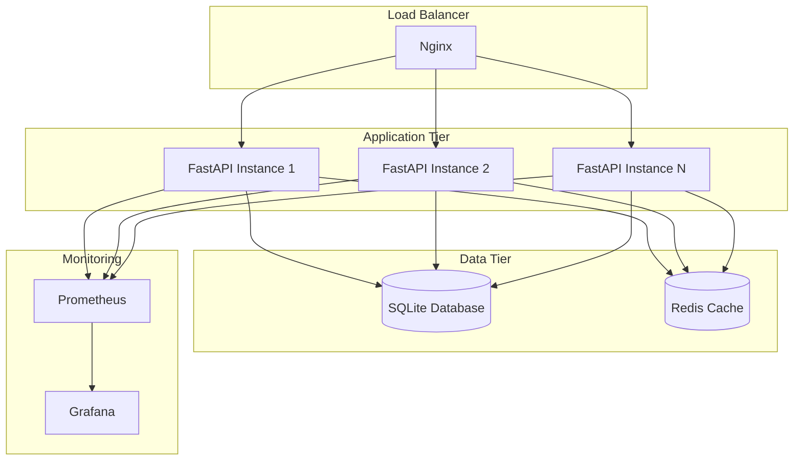

# 🚀 DOC-ENG_05_DEVOPS
## DevOps e Infraestrutura - CoinBalance Enterprise v3.0.0

**Versão:** 1.0  
**Data de Criação:** 29 de outubro de 2025  
**Última Atualização:** 29 de outubro de 2025  
**Autor:** Engenharia de Documentação Sênior  
**Status:** ✅ **COMPLETO**

---

## 📋 Sumário Executivo

Este documento descreve a infraestrutura DevOps completa do sistema CoinBalance Enterprise, incluindo ambientes de desenvolvimento, testes e produção, pipeline CI/CD, estratégias de deploy e monitoramento.

---

## 🌍 Ambientes

### **1. Ambiente de Desenvolvimento**

#### **Configuração Local**

```bash
# Requisitos
- Python 3.11+
- SQLite 3
- Git

# Setup
python -m venv venv
source venv/bin/activate  # Linux/Mac
# ou
venv\Scripts\activate     # Windows

pip install -r requirements.txt
pip install -r requirements-dev.txt

# Executar
python main.py
```

#### **Variáveis de Ambiente**

```env
# .env (desenvolvimento)
DEBUG=true
LOG_LEVEL=DEBUG
DATABASE_URL=sqlite:///blockchain.db
SECRET_KEY=dev-secret-key-change-in-production
CORS_ORIGINS=["http://localhost:3000"]
```

#### **Docker Compose (Desenvolvimento)**

```yaml
# docker-compose.yml
version: '3.8'

services:
  backend:
    build: .
    ports:
      - "8000:8000"
    environment:
      - DEBUG=true
      - LOG_LEVEL=DEBUG
    volumes:
      - ./blockchain.db:/app/blockchain.db
    command: python main.py --reload
```

**Executar:**

```bash
docker-compose up -d
```

---

### **2. Ambiente de Testes**

#### **Configuração**

```bash
# Testes Unitários
pytest tests/unit/ -v

# Testes de Integração
pytest tests/integration/ -v

# Testes E2E
pytest tests/e2e/ -v

# Todos os Testes
pytest tests/ -v --cov=src --cov-report=html
```

#### **Cobertura Atual**

- **Cobertura de Testes**: 100% (81/81 testes passando)
- **Testes Unitários**: 64 testes
- **Testes de Integração**: 8 testes
- **Testes E2E**: 15 testes
- **Testes de Performance**: 8 testes

---

### **3. Ambiente de Produção**

#### **Infraestrutura**



#### **Configuração Docker**

```dockerfile
# Dockerfile.production
FROM python:3.11-slim

WORKDIR /app

# Instalar dependências
COPY requirements.txt .
RUN pip install --no-cache-dir -r requirements.txt

# Copiar código
COPY . .

# Configurar usuário não-root
RUN useradd -m -u 1000 appuser && chown -R appuser:appuser /app
USER appuser

# Expor porta
EXPOSE 8000

# Comando de produção
CMD ["uvicorn", "src.presentation.api.app:app", "--host", "0.0.0.0", "--port", "8000", "--workers", "4"]
```

#### **Docker Compose Produção**

```yaml
# docker-compose.production.yml
version: '3.8'

services:
  backend:
    build:
      context: .
      dockerfile: Dockerfile.production
    restart: unless-stopped
    environment:
      - DEBUG=false
      - LOG_LEVEL=INFO
    volumes:
      - ./blockchain.db:/app/blockchain.db
      - ./logs:/app/logs
    healthcheck:
      test: ["CMD", "curl", "-f", "http://localhost:8000/health"]
      interval: 30s
      timeout: 10s
      retries: 3
  
  nginx:
    image: nginx:alpine
    ports:
      - "80:80"
      - "443:443"
    volumes:
      - ./nginx/nginx.conf:/etc/nginx/nginx.conf:ro
      - ./ssl:/etc/nginx/ssl:ro
    depends_on:
      - backend
  
  prometheus:
    image: prom/prometheus
    volumes:
      - ./prometheus:/etc/prometheus
    ports:
      - "9090:9090"
  
  grafana:
    image: grafana/grafana
    ports:
      - "3000:3000"
    environment:
      - GF_SECURITY_ADMIN_PASSWORD=admin
    volumes:
      - grafana-data:/var/lib/grafana

volumes:
  grafana-data:
```

---

## 🔄 CI/CD Pipeline

### **GitHub Actions Workflow**

```yaml
# .github/workflows/ci.yml
name: CI/CD Pipeline

on:
  push:
    branches: [ master, develop ]
  pull_request:
    branches: [ master ]

jobs:
  test:
    runs-on: ubuntu-latest
    
    steps:
      - uses: actions/checkout@v3
      
      - name: Set up Python
        uses: actions/setup-python@v4
        with:
          python-version: '3.11'
      
      - name: Install dependencies
        run: |
          pip install -r requirements.txt
          pip install -r requirements-dev.txt
      
      - name: Run tests
        run: |
          pytest tests/ -v --cov=src --cov-report=xml
      
      - name: Upload coverage
        uses: codecov/codecov-action@v3
        with:
          file: ./coverage.xml
  
  lint:
    runs-on: ubuntu-latest
    
    steps:
      - uses: actions/checkout@v3
      
      - name: Set up Python
        uses: actions/setup-python@v4
        with:
          python-version: '3.11'
      
      - name: Lint
        run: |
          pip install flake8 black mypy
          flake8 src tests
          black --check src tests
          mypy src
  
  build:
    needs: [test, lint]
    runs-on: ubuntu-latest
    
    steps:
      - uses: actions/checkout@v3
      
      - name: Build Docker image
        run: |
          docker build -t coinbalance:latest .
      
      - name: Push to registry
        if: github.ref == 'refs/heads/master'
        run: |
          docker tag coinbalance:latest registry.example.com/coinbalance:latest
          docker push registry.example.com/coinbalance:latest
  
  deploy:
    needs: [build]
    if: github.ref == 'refs/heads/master'
    runs-on: ubuntu-latest
    
    steps:
      - name: Deploy to production
        run: |
          # Script de deploy
          ./scripts/deploy.sh
```

---

## 🚀 Deploy

### **Deploy Manual**

#### **1. Preparação**

```bash
# 1. Atualizar código
git pull origin master

# 2. Criar backup
./scripts/backup.sh

# 3. Instalar dependências
pip install -r requirements.txt
```

#### **2. Migração de Banco de Dados**

```bash
# Verificar migrações pendentes
python scripts/check_migrations.py

# Executar migrações
python scripts/run_migrations.py
```

#### **3. Deploy**

```bash
# Parar serviços
docker-compose -f docker-compose.production.yml down

# Build nova imagem
docker-compose -f docker-compose.production.yml build

# Iniciar serviços
docker-compose -f docker-compose.production.yml up -d

# Verificar saúde
curl http://localhost:8000/health
```

### **Deploy Automatizado**

```bash
# Usando script de deploy
./scripts/deploy.sh production

# Ou via CI/CD
# Deploy automático após testes passarem
```

---

## 🔄 Rollback

### **Estratégia de Rollback**

#### **1. Rollback Rápido (Docker)**

```bash
# Parar serviços atuais
docker-compose -f docker-compose.production.yml down

# Voltar para versão anterior
docker tag coinbalance:previous coinbalance:latest

# Reiniciar serviços
docker-compose -f docker-compose.production.yml up -d
```

#### **2. Rollback de Código**

```bash
# Identificar versão anterior
git log --oneline

# Voltar para commit anterior
git checkout <commit-hash>

# Deploy da versão anterior
./scripts/deploy.sh production
```

#### **3. Rollback de Banco de Dados**

```bash
# Restaurar backup
cp backups/blockchain_<timestamp>.db blockchain.db

# Verificar integridade
sqlite3 blockchain.db "PRAGMA integrity_check;"

# Reiniciar serviços
docker-compose -f docker-compose.production.yml restart backend
```

---

## 📊 Monitoramento e Alertas

### **Prometheus**

#### **Métricas Coletadas**

- **Métricas de Aplicação**:
  - Requisições HTTP (total, por endpoint, por status)
  - Tempo de resposta
  - Erros e exceções

- **Métricas de Sistema**:
  - CPU, memória, disco
  - Rede
  - Processos

- **Métricas de Blockchain**:
  - Altura da blockchain
  - Transações por segundo
  - Blocos minerados
  - Dificuldade atual

#### **Configuração**

```yaml
# prometheus/prometheus.yml
global:
  scrape_interval: 15s

scrape_configs:
  - job_name: 'coinbalance'
    static_configs:
      - targets: ['backend:8000']
```

### **Grafana**

#### **Dashboards**

1. **Dashboard Geral**
   - Health do sistema
   - Métricas de API
   - Métricas de blockchain

2. **Dashboard de Performance**
   - Tempo de resposta
   - Throughput
   - Uso de recursos

3. **Dashboard de Blockchain**
   - Altura da blockchain
   - Transações
   - Blocos minerados

### **Alertas**

#### **Alertas Configurados**

| Alerta | Condição | Severidade |
|--------|----------|------------|
| **API Down** | Health check falha | 🔴 Crítico |
| **High Error Rate** | Taxa de erro > 5% | 🟡 Warning |
| **Low Disk Space** | Disco < 10% | 🟡 Warning |
| **Blockchain Stuck** | Sem novos blocos em 10min | 🔴 Crítico |
| **High Memory Usage** | Memória > 80% | 🟡 Warning |

---

## 🔒 Segurança DevOps

### **Boas Práticas**

1. **Secrets Management**
   - Variáveis de ambiente para secrets
   - Não commitar secrets no Git
   - Usar vaults (HashiCorp Vault, AWS Secrets Manager)

2. **Imagens Docker**
   - Imagens base oficiais
   - Usuário não-root
   - Scan de vulnerabilidades

3. **Rede**
   - Firewall configurado
   - Apenas portas necessárias expostas
   - SSL/TLS em produção

---

## 📈 Escalabilidade

### **Estratégias de Escala**

#### **Escala Horizontal**

```yaml
# docker-compose.production.yml
services:
  backend:
    deploy:
      replicas: 3
      update_config:
        parallelism: 1
        delay: 10s
```

#### **Load Balancing**

```nginx
# nginx/nginx.conf
upstream backend {
    least_conn;
    server backend1:8000;
    server backend2:8000;
    server backend3:8000;
}

server {
    listen 80;
    
    location / {
        proxy_pass http://backend;
        proxy_set_header Host $host;
        proxy_set_header X-Real-IP $remote_addr;
    }
}
```

---

## ✅ Histórico de Versões

| Versão | Data | Alterações | Autor |
|--------|------|------------|-------|
| 1.0 | 29/10/2025 | Criação da documentação DevOps | Eng. Documentação Sênior |

---

**Status:** ✅ **FASE 3 PARCIAL - DEVOPS DOCUMENTADO**

