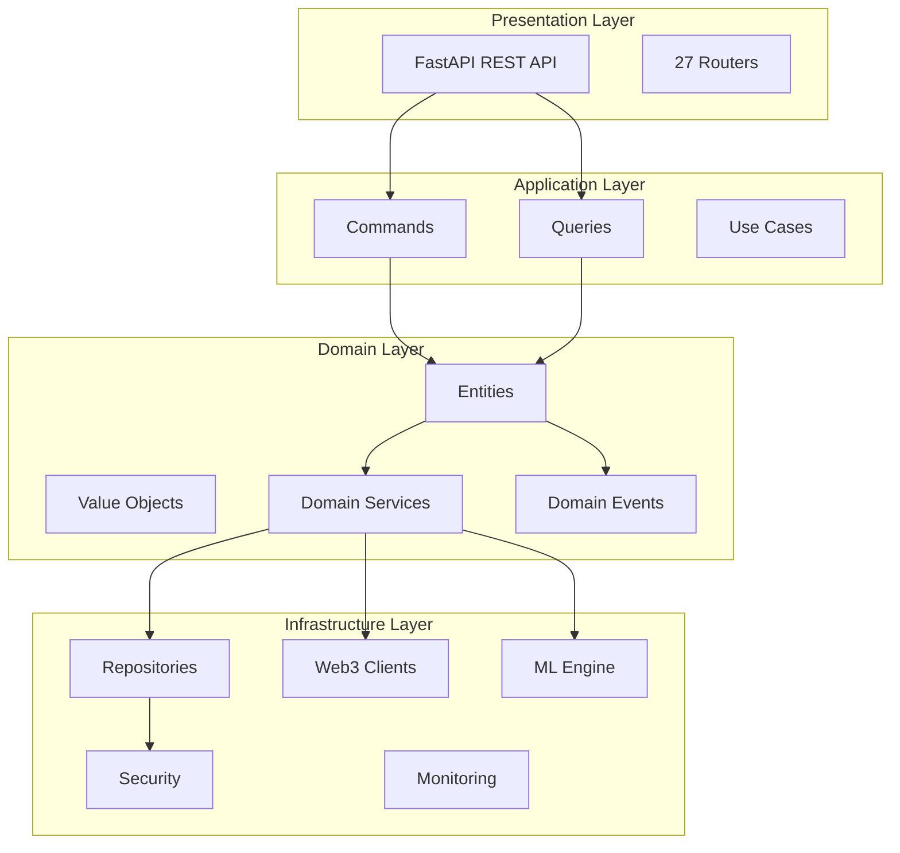
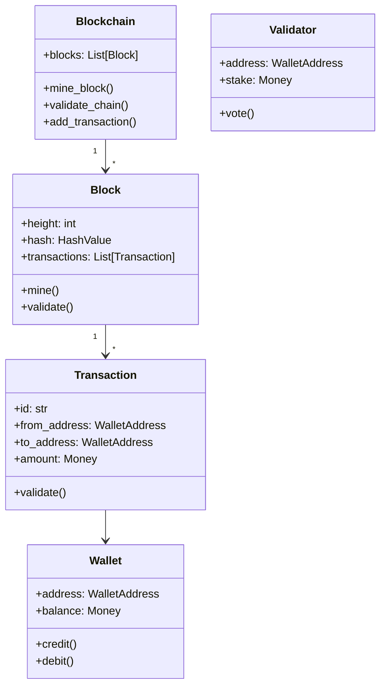
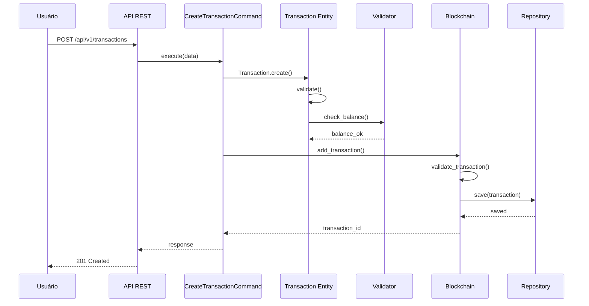
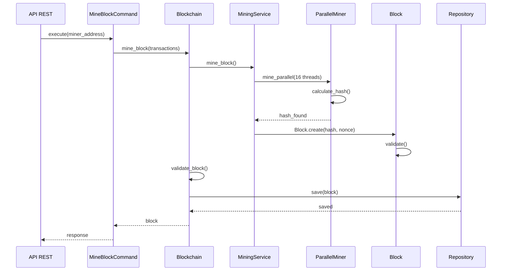
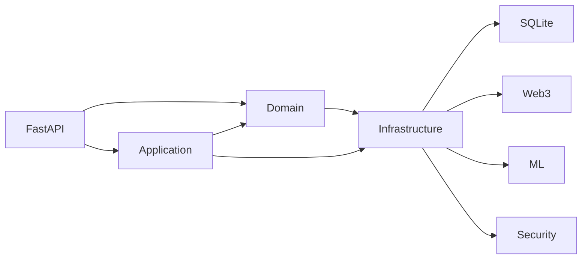

# 🗺️ DOC-ENG_07_MAPA_ARQUITETURA_ATUAL
## Mapa de Arquitetura Atual - Engenharia Reversa

**Versão:** 1.0  
**Data de Criação:** 29 de outubro de 2025  
**Última Atualização:** 29 de outubro de 2025  
**Autor:** Engenharia de Documentação Sênior  
**Status:** ✅ **COMPLETO**

---

## 📋 Sumário Executivo

Este documento apresenta o mapa completo da arquitetura atual do sistema CoinBalance, obtido através de engenharia reversa do código-fonte. Inclui diagramas C4 detalhados, fluxos principais e mapeamento de componentes.

---

## 🏗️ Arquitetura de Alto Nível

### **Camadas Arquiteturais**



---

## 📦 Componentes Principais por Camada

### **Presentation Layer (27 Routers)**

| Router | Endpoints | Propósito |
|--------|-----------|-----------|
| `wallet_router` | 2 | Gerenciamento de carteiras |
| `blockchain_router` | 5+ | Operações blockchain |
| `transaction_router` | 4+ | Transações |
| `consensus_router` | 5+ | Consenso distribuído |
| `web3_router` | 8+ | Integração Web3 |
| `monitoring_router` | 6+ | Monitoramento |
| `auth_router` | 3 | Autenticação |
| `security_router` | 4+ | Segurança |
| `ai_advanced_router` | 15+ | IA avançada |
| `web3_advanced_router` | 20+ | Web3 avançado |
| `lgpd_router` | 8 | Conformidade LGPD |
| Outros | 50+ | Funcionalidades diversas |

**Total de Endpoints Identificados:** ~250+ endpoints REST

---

### **Application Layer**

#### **Commands (CQRS)**

```python
# Wallet Commands
CreateWalletCommand
UpdateWalletCommand

# Transaction Commands
CreateTransferCommand
CreateTransactionCommand

# Consensus Commands
RegisterValidatorCommand
StakeCommand
```

#### **Queries (CQRS)**

```python
# Wallet Queries
GetWalletQuery
ListWalletsQuery

# Transaction Queries
GetTransactionQuery
ListTransactionsQuery
GetTransactionHistoryQuery

# Blockchain Queries
GetBlockchainStatsQuery
GetBlockQuery
ListBlocksQuery
```

---

### **Domain Layer**

#### **Aggregate Roots**



---

### **Infrastructure Layer**

#### **Repositories**

```python
# Implementações
SQLiteWalletRepository
SQLiteTransactionRepository
SQLiteBlockRepository
SQLiteValidatorRepository
```

#### **Serviços de Infraestrutura**

| Serviço | Localização | Propósito |
|---------|------------|-----------|
| **MiningService** | `domain/blockchain/services/` | Mineração paralela |
| **ConsensusService** | `domain/consensus/services/` | Consenso distribuído |
| **Web3Service** | `infrastructure/web3/` | Integração Web3 |
| **MLService** | `infrastructure/ai/` | Machine Learning |
| **SecurityService** | `infrastructure/security/` | Segurança |
| **MonitoringService** | `infrastructure/monitoring/` | Monitoramento |

---

## 🔄 Fluxos Principais

### **Fluxo de Criação de Transação**



---

### **Fluxo de Mineração**



---

## 📊 Mapeamento de Dependências

### **Dependências Principais**



---

## ✅ Histórico de Versões

| Versão | Data | Alterações | Autor |
|--------|------|------------|-------|
| 1.0 | 29/10/2025 | Criação do mapa de arquitetura atual | Eng. Documentação Sênior |

---

**Status:** ✅ **FASE 3 COMPLETA - MAPA DE ARQUITETURA CRIADO**

