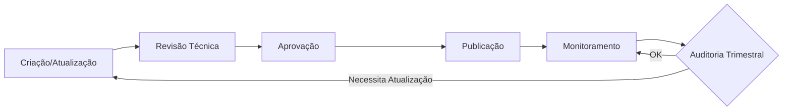
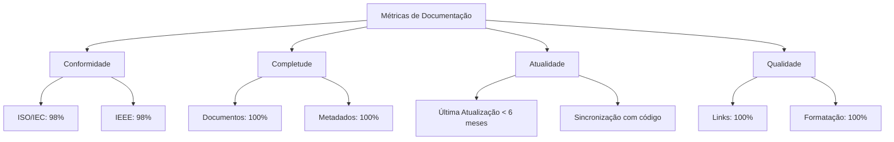

# 📋 DOC-ENG_09_GOVERNANCA_DOCUMENTAL
## Ciclo de Governança Documental - CoinBalance Enterprise

**Versão:** 1.0  
**Data de Criação:** 29 de outubro de 2025  
**Última Atualização:** 29 de outubro de 2025  
**Autor:** Engenharia de Documentação Sênior  
**Status:** ✅ **COMPLETO**

---

## 📋 Sumário Executivo

Este documento estabelece o ciclo completo de governança documental para o sistema CoinBalance Enterprise, incluindo processos de auditoria, revisão periódica e logs de atualização automática.

---

## 🔄 Ciclo de Governança Documental

### **Visão Geral do Ciclo**



---

## 📅 Auditorias Trimestrais

### **Frequência**

- **Trimestral**: A cada 3 meses (Janeiro, Abril, Julho, Outubro)
- **Anual**: Revisão completa no último trimestre

### **Checklist de Auditoria**

#### **1. Conformidade com Padrões**

- [ ] Verificar conformidade ISO/IEC 15289
- [ ] Verificar conformidade ISO/IEC 12207
- [ ] Verificar conformidade IEEE 830
- [ ] Verificar conformidade IEEE 1471

#### **2. Completude**

- [ ] Todos os documentos obrigatórios presentes
- [ ] Metadados completos (versão, data, autor)
- [ ] Histórico de versões atualizado
- [ ] Índices presentes quando necessário

#### **3. Consistência**

- [ ] Terminologia consistente com glossário
- [ ] Versões consistentes entre documentos
- [ ] Datas consistentes
- [ ] Links funcionais verificados

#### **4. Atualidade**

- [ ] Última atualização < 6 meses
- [ ] Informações sincronizadas com código
- [ ] Exemplos de código funcionais
- [ ] Diagramas atualizados

#### **5. Qualidade**

- [ ] Formatação correta
- [ ] Ortografia e gramática verificadas
- [ ] Estrutura lógica
- [ ] Legibilidade adequada

### **Relatório de Auditoria**

Após cada auditoria, gerar relatório:

```markdown
# Relatório de Auditoria Trimestral - QX 2025

**Data:** DD/MM/AAAA
**Auditor:** [Nome]
**Documentos Auditados:** X

## Resultados

- Conformidade: X%
- Completude: X%
- Consistência: X%
- Atualidade: X%

## Problemas Identificados

[Lista de problemas]

## Ações Recomendadas

[Lista de ações]
```

---

## 🔄 Revisão por Release

### **Frequência**

- **Antes de cada release major**
- **Opcional para releases minor**

### **Checklist de Revisão**

- [ ] README.md atualizado
- [ ] CHANGELOG.md atualizado
- [ ] Documentação de API atualizada
- [ ] Manual do usuário atualizado (se necessário)
- [ ] Documentação de deploy atualizada
- [ ] Relatório de release criado

### **Template de Relatório de Release**

```markdown
# Release Notes - vX.Y.Z

**Data:** DD/MM/AAAA
**Tipo:** Major/Minor/Patch

## Mudanças

- [Lista de mudanças]

## Documentação Atualizada

- [Lista de documentos atualizados]

## Breaking Changes

- [Lista de breaking changes]
```

---

## 📝 Logs de Atualização Automática

### **Sistema de Logging**

Todos os documentos devem incluir seção de histórico:

```markdown
## ✅ Histórico de Versões

| Versão | Data | Alterações | Autor |
|--------|------|------------|-------|
| 1.0 | 29/10/2025 | Criação inicial | Eng. Documentação |
| 1.1 | 15/11/2025 | Atualização X | Eng. Documentação |
```

### **Automação de Logging**

#### **Git Hooks**

```bash
# .git/hooks/pre-commit
#!/bin/bash
# Verificar se documento foi atualizado sem atualizar versão
# (implementação futura)
```

#### **CI/CD Validation**

```yaml
# .github/workflows/validate-docs.yml
name: Validate Documentation

on:
  pull_request:
    paths:
      - 'docs/**/*.md'

jobs:
  validate:
    runs-on: ubuntu-latest
    steps:
      - uses: actions/checkout@v3
      - name: Validate Markdown
        run: |
          pip install markdownlint-cli2
          markdownlint-cli2 'docs/**/*.md'
      - name: Check Links
        run: |
          pip install markdown-link-check
          find docs -name "*.md" -exec markdown-link-check {} \;
      - name: Validate Metadata
        run: |
          python scripts/validate_doc_metadata.py
```

---

## 📊 Métricas de Governança

### **Métricas Mensais**

| Métrica | Meta | Medição |
|---------|------|---------|
| **Documentos Atualizados** | > 5 | Contagem automática |
| **Links Quebrados** | 0 | Validação automática |
| **Conformidade** | > 95% | Auditoria trimestral |

### **Dashboard de Métricas**



---

## 🔄 Processo de Manutenção Contínua

### **Tarefas Diárias**

- [ ] Verificar links quebrados automaticamente
- [ ] Validar formato Markdown
- [ ] Atualizar changelog se necessário

### **Tarefas Semanais**

- [ ] Revisar documentos modificados
- [ ] Validar consistência terminológica
- [ ] Atualizar índices se necessário

### **Tarefas Mensais**

- [ ] Relatório de status mensal
- [ ] Identificar documentos não atualizados
- [ ] Planejar próximas atualizações

### **Tarefas Trimestrais**

- [ ] Auditoria completa
- [ ] Relatório de conformidade
- [ ] Planejamento de melhorias

---

## 👥 Responsabilidades

### **Engenharia de Documentação**

- Criar e manter documentação técnica
- Executar auditorias trimestrais
- Validar qualidade e conformidade

### **Desenvolvedores**

- Atualizar documentação junto com código
- Revisar pull requests documentais
- Reportar documentação desatualizada

### **Tech Leads**

- Aprovar mudanças documentais significativas
- Revisar arquitetura documental
- Garantir padrões

---

## 📚 Referências

- [Controle e Garantia de Qualidade de Documentação](../CONTROLE_GARANTIA_QUALIDADE_DOCUMENTACAO.md)
- [Arquitetura Documental Padrão](./DOC-ENG_01_ARQUITETURA_DOCUMENTAL_PADRAO.md)
- [Auditoria de Conformidade](../AUDITORIA_CONFORMIDADE_DOCUMENTACAO.md)

---

## ✅ Histórico de Versões

| Versão | Data | Alterações | Autor |
|--------|------|------------|-------|
| 1.0 | 29/10/2025 | Criação do ciclo de governança documental | Eng. Documentação Sênior |

---

**Status:** ✅ **FASE 4 COMPLETA - GOVERNAÇA DOCUMENTAL ESTABELECIDA**

