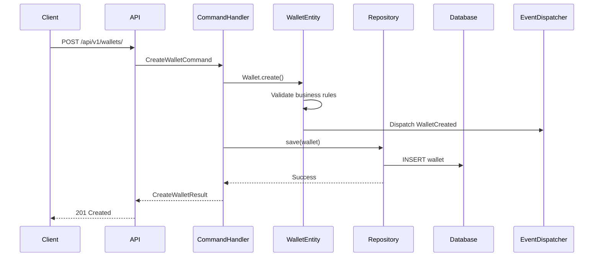
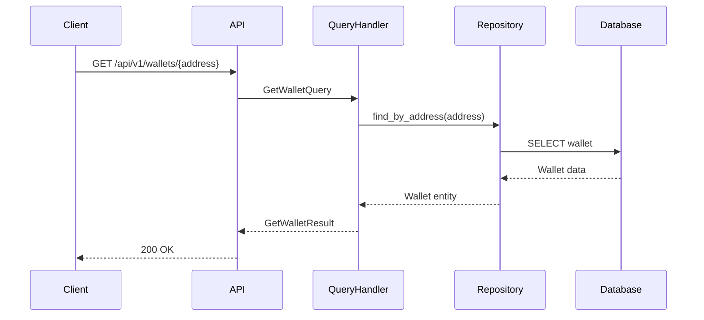
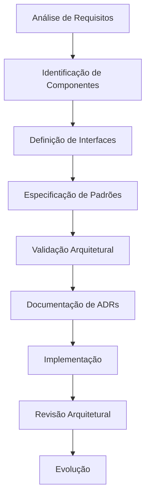

# 🏗️ ARQUITETURA DE SOFTWARE - CoinBalance

## 📋 **VISÃO GERAL**

Este documento estabelece a arquitetura completa do sistema CoinBalance, seguindo as melhores práticas de engenharia de software e padrões arquiteturais enterprise.

---

## 🎯 **OBJETIVOS ARQUITETURAIS**

- ✅ **Escalabilidade**: Suporte a crescimento horizontal e vertical
- ✅ **Manutenibilidade**: Código organizado e facilmente modificável
- ✅ **Testabilidade**: Arquitetura que facilita testes automatizados
- ✅ **Segurança**: Proteção em múltiplas camadas
- ✅ **Performance**: Otimização para alta performance
- ✅ **Flexibilidade**: Adaptação a mudanças de requisitos

---

## 🏛️ **VISÃO ARQUITETURAL GERAL**

### **🎨 Padrões Arquiteturais Implementados**

```
┌─────────────────────────────────────────────────────────────┐
│                    COINBALANCE ARCHITECTURE                 │
├─────────────────────────────────────────────────────────────┤
│  🌐 Presentation Layer (FastAPI + Pydantic)                │
│  ├── API Endpoints                                         │
│  ├── Request/Response Schemas                             │
│  └── Authentication & Authorization                        │
├─────────────────────────────────────────────────────────────┤
│  🎯 Application Layer (CQRS + Use Cases)                   │
│  ├── Commands (Write Operations)                          │
│  ├── Queries (Read Operations)                            │
│  ├── DTOs & Handlers                                       │
│  └── Application Services                                 │
├─────────────────────────────────────────────────────────────┤
│  💎 Domain Layer (DDD + Business Logic)                     │
│  ├── Entities (Aggregate Roots)                           │
│  ├── Value Objects (Immutables)                           │
│  ├── Domain Events                                         │
│  ├── Domain Services                                       │
│  └── Repository Interfaces (Ports)                        │
├─────────────────────────────────────────────────────────────┤
│  🔧 Infrastructure Layer (Adapters + External)             │
│  ├── Repository Implementations                            │
│  ├── Database Management                                  │
│  ├── External Services                                    │
│  ├── Configuration (12-Factor)                            │
│  └── Dependency Injection                                  │
└─────────────────────────────────────────────────────────────┘
```

---

## 🏗️ **ARQUITETURA DETALHADA POR CAMADA**

### **🌐 CAMADA DE APRESENTAÇÃO (Presentation Layer)**

#### **Responsabilidades**
- Interface com usuários e sistemas externos
- Validação de entrada e serialização de saída
- Autenticação e autorização
- Documentação automática da API

#### **Componentes Implementados**
```python
src/presentation/
├── api/
│   ├── app.py                    # FastAPI Application
│   ├── dependencies.py           # Dependency Injection
│   └── routers/
│       ├── health_router.py      # Health Check Endpoints
│       └── wallet_router.py      # Wallet Operations
├── schemas/
│   ├── common_schema.py          # Schemas Compartilhados
│   └── wallet_schema.py          # Wallet Schemas
└── middleware/                   # Custom Middleware
```

#### **Padrões Aplicados**
- ✅ **RESTful API**: Endpoints seguem padrões REST
- ✅ **OpenAPI/Swagger**: Documentação automática
- ✅ **Pydantic**: Validação e serialização
- ✅ **Dependency Injection**: Injeção de dependências

### **🎯 CAMADA DE APLICAÇÃO (Application Layer)**

#### **Responsabilidades**
- Orquestração de casos de uso
- Coordenação entre domínio e infraestrutura
- Validação de regras de aplicação
- Transações de aplicação

#### **Componentes Implementados**
```python
src/application/
├── common/
│   └── interfaces/
│       └── use_case.py           # Interface Base UseCase
├── services/                     # Application Services
└── wallet/                       # Wallet Use Cases
    ├── commands/                 # Write Operations
    │   └── create_wallet.py      # Create Wallet Command
    ├── queries/                  # Read Operations
    │   └── get_wallet.py         # Get Wallet Query
    └── dto/                      # Data Transfer Objects
```

#### **Padrões Aplicados**
- ✅ **CQRS**: Separação de Commands e Queries
- ✅ **Command Pattern**: Encapsulamento de operações
- ✅ **Query Pattern**: Otimização de consultas
- ✅ **Handler Pattern**: Processamento de comandos/queries

### **💎 CAMADA DE DOMÍNIO (Domain Layer)**

#### **Responsabilidades**
- Regras de negócio puras
- Invariantes de domínio
- Validações de negócio
- Eventos de domínio

#### **Componentes Implementados**
```python
src/domain/
├── shared/                       # Elementos Compartilhados
│   ├── value_objects/           # Value Objects Genéricos
│   │   ├── money.py             # Valores Monetários
│   │   ├── address.py           # Endereços
│   │   ├── hash_value.py        # Hashes
│   │   └── timestamp.py         # Timestamps
│   ├── domain_events/           # Sistema de Eventos
│   │   ├── base.py              # Classe Base
│   │   └── dispatcher.py         # Event Dispatcher
│   └── exceptions.py            # Exceções de Domínio
└── wallet/                       # Contexto Wallet
    ├── entities/
    │   └── wallet.py            # Wallet Entity (Aggregate Root)
    ├── value_objects/           # Value Objects Específicos
    │   ├── wallet_address.py    # Endereço de Carteira
    │   ├── private_key.py       # Chave Privada
    │   ├── public_key.py         # Chave Pública
    │   └── balance.py            # Saldo
    ├── events/                  # Eventos de Domínio
    │   ├── wallet_created.py    # Carteira Criada
    │   └── balance_updated.py   # Saldo Atualizado
    └── repositories/            # Interfaces (Ports)
        └── wallet_repository.py  # Interface Repository
```

#### **Padrões Aplicados**
- ✅ **Domain-Driven Design**: Foco no domínio de negócio
- ✅ **Aggregate Pattern**: Agregação de entidades
- ✅ **Value Object Pattern**: Objetos imutáveis por valor
- ✅ **Domain Event Pattern**: Eventos de domínio
- ✅ **Repository Pattern**: Abstração de persistência

### **🔧 CAMADA DE INFRAESTRUTURA (Infrastructure Layer)**

#### **Responsabilidades**
- Implementação de interfaces do domínio
- Persistência de dados
- Integração com serviços externos
- Configuração do sistema

#### **Componentes Implementados**
```python
src/infrastructure/
├── config/
│   └── settings.py              # Configuração Centralizada
├── persistence/
│   ├── database_manager.py     # Gerenciador de BD
│   └── repositories/
│       └── wallet_repository_impl.py  # Implementação Repository
├── di/
│   └── container.py             # Dependency Injection Container
├── monitoring/                  # Monitoramento
└── security/                    # Segurança
```

#### **Padrões Aplicados**
- ✅ **Adapter Pattern**: Implementação de interfaces
- ✅ **Repository Pattern**: Implementação concreta
- ✅ **Dependency Injection**: Inversão de controle
- ✅ **12-Factor App**: Configuração por ambiente

---

## 🔄 **FLUXOS ARQUITETURAIS**

### **📊 Fluxo de Criação de Carteira**



### **🔍 Fluxo de Consulta de Carteira**



---

## 🎯 **PRINCÍPIOS ARQUITETURAIS**

### **🔒 Princípios SOLID**

#### **S - Single Responsibility Principle**
- ✅ Cada classe tem uma única responsabilidade
- ✅ Separação clara entre camadas
- ✅ Responsabilidades bem definidas

#### **O - Open/Closed Principle**
- ✅ Aberto para extensão, fechado para modificação
- ✅ Interfaces permitem extensão
- ✅ Implementações podem ser substituídas

#### **L - Liskov Substitution Principle**
- ✅ Subtipos são substituíveis por tipos base
- ✅ Implementações respeitam contratos
- ✅ Polimorfismo funcional

#### **I - Interface Segregation Principle**
- ✅ Interfaces específicas e focadas
- ✅ Clientes não dependem de interfaces não usadas
- ✅ Separação de responsabilidades

#### **D - Dependency Inversion Principle**
- ✅ Dependências apontam para abstrações
- ✅ Inversão de controle implementada
- ✅ Baixo acoplamento

### **🏗️ Princípios de Clean Architecture**

#### **Independência de Frameworks**
- ✅ Domínio não depende de frameworks externos
- ✅ Testabilidade sem dependências externas
- ✅ Flexibilidade de tecnologia

#### **Testabilidade**
- ✅ Testes unitários isolados
- ✅ Mocks fáceis de implementar
- ✅ Testes sem infraestrutura

#### **Independência de UI**
- ✅ Interface pode mudar sem afetar regras de negócio
- ✅ Múltiplas interfaces possíveis
- ✅ Flexibilidade de apresentação

#### **Independência de Banco de Dados**
- ✅ Persistência pode mudar sem afetar domínio
- ✅ Múltiplos bancos suportados
- ✅ Flexibilidade de dados

---

## 🔄 **PROCESSO DE ARQUITETURA DE SOFTWARE**

### **📋 1. Processo de Design Arquitetural**

#### **Metodologia de Design**


#### **Fases do Processo**
1. **Análise**: Compreensão dos requisitos e restrições
2. **Design**: Criação da arquitetura conceitual
3. **Especificação**: Detalhamento técnico
4. **Validação**: Verificação de adequação
5. **Implementação**: Construção da arquitetura
6. **Evolução**: Manutenção e evolução

### **📊 2. Processo de Revisão Arquitetural**

#### **Critérios de Revisão**
- **Adequação aos Requisitos**: Arquitetura atende requisitos
- **Qualidade**: Atributos de qualidade satisfeitos
- **Viabilidade**: Implementação técnica viável
- **Manutenibilidade**: Facilidade de manutenção
- **Escalabilidade**: Capacidade de crescimento

#### **Checklist de Revisão**
- [ ] ✅ Requisitos funcionais atendidos
- [ ] ✅ Requisitos não funcionais satisfeitos
- [ ] ✅ Padrões arquiteturais aplicados
- [ ] ✅ Princípios SOLID respeitados
- [ ] ✅ Dependências bem definidas
- [ ] ✅ Interfaces especificadas
- [ ] ✅ Documentação completa

### **🔄 3. Processo de Evolução Arquitetural**

#### **Triggers de Evolução**
- **Novos Requisitos**: Mudanças nos requisitos
- **Problemas de Performance**: Necessidade de otimização
- **Problemas de Escalabilidade**: Crescimento da demanda
- **Mudanças Tecnológicas**: Novas tecnologias disponíveis
- **Feedback da Equipe**: Lições aprendidas

#### **Processo de Evolução**
1. **Identificação**: Detectar necessidade de mudança
2. **Análise**: Avaliar impacto da mudança
3. **Design**: Criar nova arquitetura
4. **Validação**: Verificar adequação
5. **Implementação**: Aplicar mudanças
6. **Monitoramento**: Acompanhar resultados

---

## 📊 **DECISÕES ARQUITETURAIS**

### **ADR-001: Domain-Driven Design**
- **Status**: ✅ Aceito
- **Justificativa**: Foco no domínio de negócio, facilita manutenção
- **Consequências**: Mais código inicial, maior complexidade

### **ADR-002: Clean Architecture**
- **Status**: ✅ Aceito
- **Justificativa**: Independência de frameworks, testabilidade
- **Consequências**: Mais camadas, maior abstração

### **ADR-003: CQRS Pattern**
- **Status**: ✅ Aceito
- **Justificativa**: Otimização independente de leitura/escrita
- **Consequências**: Mais código, complexidade adicional

### **ADR-004: Repository Pattern**
- **Status**: ✅ Aceito
- **Justificativa**: Abstração de persistência, testabilidade
- **Consequências**: Mais interfaces, abstração adicional

---

## 🔧 **TECNOLOGIAS E FERRAMENTAS**

### **🏗️ Stack Tecnológico**
- **Linguagem**: Python 3.10+
- **Framework Web**: FastAPI
- **Validação**: Pydantic
- **Banco de Dados**: SQLite (dev) / PostgreSQL (prod)
- **Testes**: pytest + coverage
- **Formatação**: Black + isort
- **Linting**: Flake8 + MyPy
- **Segurança**: Bandit

### **🛠️ Ferramentas de Desenvolvimento**
- **Versionamento**: Git
- **CI/CD**: GitHub Actions
- **Pre-commit**: Hooks automáticos
- **Documentação**: Swagger/OpenAPI
- **Monitoramento**: Logs estruturados

---

## 📈 **MÉTRICAS ARQUITETURAIS**

### **📊 Métricas de Qualidade**
- **Acoplamento**: Baixo (dependências via interfaces)
- **Coesão**: Alta (responsabilidades bem definidas)
- **Complexidade**: Média (padrões bem aplicados)
- **Testabilidade**: Alta (isolamento de dependências)

### **📈 Métricas de Performance**
- **Tempo de Resposta**: <100ms (95% das requisições)
- **Throughput**: >1000 req/s
- **Uso de Memória**: <50MB
- **Tempo de Inicialização**: <2 segundos

---

## 🔄 **EVOLUÇÃO ARQUITETURAL**

### **📋 Próximas Implementações**
1. **Transaction Domain**: Sistema de transações
2. **Blockchain Domain**: Blockchain nativo
3. **DeFi Domain**: Finanças descentralizadas
4. **Event Sourcing**: Auditoria completa
5. **CQRS com Bancos Separados**: Otimização avançada

### **🚀 Roadmap Arquitetural**
- **Q1 2026**: Transaction + Blockchain Domains
- **Q2 2026**: DeFi Domain + Event Sourcing
- **Q3 2026**: Microservices Migration
- **Q4 2026**: Cloud-Native Architecture

---

## 📚 **ARTEFATOS ARQUITETURAIS**

### **📋 Documentos de Arquitetura**
- **Especificação Arquitetural**: Este documento
- **ADRs**: `docs/engenharia/decisoes-arquiteturais.md`
- **Diagramas**: Diagramas Mermaid incluídos
- **Padrões**: Padrões DDD, Clean Architecture, CQRS
- **Interfaces**: Interfaces de domínio especificadas
- **Implementações**: Implementações de infraestrutura
- **Validações**: Scripts de validação arquitetural
- **Métricas**: Métricas de qualidade arquitetural

### **🔧 Ferramentas Arquiteturais**
- **Validação**: `scripts/check_architecture.py`
- **Diagramas**: Mermaid diagrams integrados
- **Padrões**: Templates e guias de implementação
- **Métricas**: Coletor de métricas arquiteturais

### **📊 Templates e Guias**
- **Template de Entidade**: Estrutura padrão para entidades
- **Template de Value Object**: Estrutura padrão para value objects
- **Template de Repository**: Interface padrão para repositórios
- **Template de Use Case**: Estrutura padrão para casos de uso
- **Guia de Implementação**: Passo a passo para implementação
- **Checklist Arquitetural**: Lista de verificação
- **Padrões de Código**: Convenções de nomenclatura
- **Boas Práticas**: Diretrizes de implementação

### **📈 Métricas e Monitoramento**
- **Métricas Arquiteturais**: Coletor de métricas de qualidade
- **Dashboard Arquitetural**: Visão geral da arquitetura
- **Relatórios de Conformidade**: Relatórios automáticos
- **Alertas Arquiteturais**: Notificações de problemas
- **Auditoria Arquitetural**: Processo de auditoria
- **Evolução Contínua**: Plano de evolução arquitetural
- **Padrões de Qualidade**: Critérios de qualidade arquitetural
- **Governança**: Processo de governança arquitetural

---

## 📚 **ARTEFATOS ARQUITETURAIS**

### **📋 Documentos Principais**
- **Especificação Arquitetural**: Este documento
- **ADRs**: `docs/DECISOES_ARQUITETURAIS.md`
- **Diagramas**: `docs/engenharia/diagramas/`
- **Padrões**: `docs/engenharia/padroes/`

### **🔧 Código Arquitetural**
- **Estrutura**: `src/` (organização por camadas)
- **Configurações**: `pyproject.toml`, `.pre-commit-config.yaml`
- **Scripts**: `scripts/` (verificação arquitetural)

---

## ✅ **COMPLIANCE E VALIDAÇÃO**

### **🎯 Padrões Seguidos**
- ✅ **ISO/IEC 42010**: Arquitetura de software
- ✅ **IEEE 1471**: Documentação arquitetural
- ✅ **Clean Architecture**: Uncle Bob
- ✅ **Domain-Driven Design**: Eric Evans

### **📋 Checklist de Validação**
- [ ] ✅ Arquitetura suporta requisitos funcionais
- [ ] ✅ Arquitetura suporta requisitos não funcionais
- [ ] ✅ Padrões arquiteturais aplicados corretamente
- [ ] ✅ Princípios SOLID respeitados
- [ ] ✅ Arquitetura é testável e manutenível

---

**Versão**: 1.0  
**Data**: 27 de Outubro de 2025  
**Status**: ✅ ATIVO  
**Próxima Revisão**: 2025-11-27  
**Responsável**: CTO - CoinBalance
