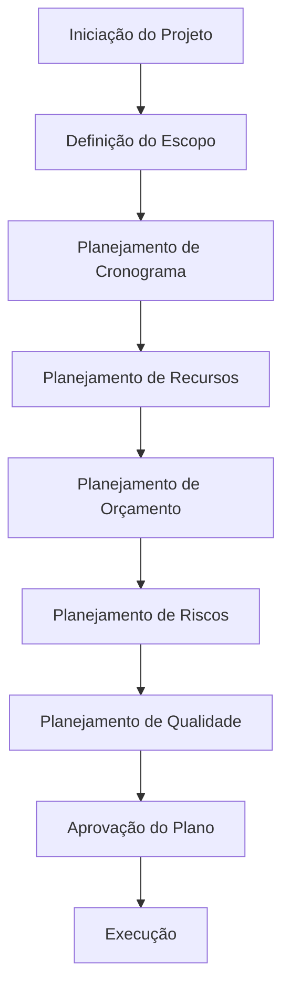

# 📊 GESTÃO DE PROJETO - CoinBalance

## 📋 **VISÃO GERAL**

Este documento estabelece o processo completo de gestão de projeto para o CoinBalance, seguindo as melhores práticas de PMI e metodologias ágeis, garantindo entrega de valor e controle de qualidade.

---

## 🎯 **OBJETIVOS DO PROJETO**

### **🎯 Objetivo Principal**
Desenvolver uma plataforma blockchain completa e consciente que promova inclusão financeira e educação econômica através de tecnologia descentralizada.

### **📊 Objetivos Específicos**
- ✅ **Técnico**: Implementar arquitetura DDD robusta e escalável
- ✅ **Negócio**: Criar moeda digital CNB com funcionalidades DeFi
- ✅ **Social**: Promover inclusão financeira e educação econômica
- ✅ **Qualidade**: Manter padrões enterprise de desenvolvimento
- ✅ **Segurança**: Garantir proteção de dados e transações

---

## 📈 **ESCOPO DO PROJETO**

### **✅ Incluído no Escopo**

#### **Funcionalidades Core**
- ✅ **Sistema de Carteiras**: Criação e gerenciamento
- 🔄 **Sistema de Transações**: Processamento e validação
- 📋 **Blockchain Nativo**: Cadeia de blocos proprietária
- 📋 **Sistema DeFi**: Staking, empréstimos, governança
- ✅ **API REST**: Interface de programação completa

#### **Infraestrutura**
- ✅ **Arquitetura DDD**: Domain-Driven Design implementado
- ✅ **Sistema de Qualidade**: Gates e verificações automáticas
- ✅ **CI/CD Pipeline**: Deploy automatizado
- ✅ **Monitoramento**: Logs e métricas estruturadas
- ✅ **Documentação**: Completa e atualizada

#### **Qualidade e Segurança**
- ✅ **Testes Automatizados**: Cobertura ≥80%
- ✅ **Segurança**: OWASP Top 10 compliance
- ✅ **Performance**: <100ms por endpoint
- ✅ **Escalabilidade**: Suporte a 10.000 usuários

### **❌ Excluído do Escopo**

#### **Funcionalidades Futuras**
- ❌ **Mobile App**: Aplicativo móvel nativo
- ❌ **Web Interface**: Interface web completa
- ❌ **Integração Bancária**: Conexão com bancos tradicionais
- ❌ **Multi-currency**: Suporte a outras moedas

#### **Tecnologias Não Utilizadas**
- ❌ **React/Vue**: Frontend frameworks
- ❌ **Kubernetes**: Orquestração de containers
- ❌ **Redis**: Cache distribuído
- ❌ **Microservices**: Arquitetura de microsserviços

---

## ⏰ **CRONOGRAMA DO PROJETO**

### **📅 Fases do Projeto**

#### **Fase 1: Fundação (Concluída)**
```
Período: 2025-09-01 a 2025-10-27
Duração: 8 semanas
Status: ✅ CONCLUÍDA

Entregas:
✅ Arquitetura DDD implementada
✅ Sistema de carteiras funcional
✅ API REST completa
✅ Sistema de qualidade automatizado
✅ Documentação técnica completa
```

#### **Fase 2: Transações (Em Andamento)**
```
Período: 2025-10-28 a 2025-12-15
Duração: 7 semanas
Status: 🔄 EM ANDAMENTO

Entregas Planejadas:
🔄 Sistema de transações completo
🔄 Validação de blockchain
🔄 Testes de integração
🔄 Documentação de transações
```

#### **Fase 3: Blockchain (Planejada)**
```
Período: 2025-12-16 a 2026-02-28
Duração: 10 semanas
Status: 📋 PLANEJADA

Entregas Planejadas:
📋 Blockchain nativo implementado
📋 Sistema de consenso (Proof of Work)
📋 Mineração de blocos
📋 Validação de integridade
```

#### **Fase 4: DeFi (Planejada)**
```
Período: 2026-03-01 a 2026-05-31
Duração: 13 semanas
Status: 📋 PLANEJADA

Entregas Planejadas:
📋 Sistema de staking
📋 Empréstimos descentralizados
📋 Governança por tokens
📋 Calculadora de juros
```

### **📊 Cronograma Detalhado**

| Atividade | Início | Fim | Duração | Status | Responsável |
|-----------|--------|-----|---------|--------|-------------|
| **Fase 1: Fundação** | 2025-09-01 | 2025-10-27 | 8 sem | ✅ | Equipe Core |
| Arquitetura DDD | 2025-09-01 | 2025-09-15 | 2 sem | ✅ | Arquiteto |
| Sistema Carteiras | 2025-09-16 | 2025-10-01 | 2 sem | ✅ | Dev Senior |
| API REST | 2025-10-02 | 2025-10-15 | 2 sem | ✅ | Dev Full-stack |
| Qualidade & Docs | 2025-10-16 | 2025-10-27 | 2 sem | ✅ | QA + Tech Writer |
| **Fase 2: Transações** | 2025-10-28 | 2025-12-15 | 7 sem | 🔄 | Equipe Core |
| Domain Transações | 2025-10-28 | 2025-11-11 | 2 sem | 🔄 | Dev Senior |
| Validação Blockchain | 2025-11-12 | 2025-11-25 | 2 sem | 📋 | Dev Blockchain |
| Testes Integração | 2025-11-26 | 2025-12-08 | 2 sem | 📋 | QA Engineer |
| Documentação | 2025-12-09 | 2025-12-15 | 1 sem | 📋 | Tech Writer |

---

## 👥 **EQUIPE DO PROJETO**

### **🏗️ Estrutura Organizacional**

#### **CTO (Chief Technology Officer)**
- **Nome**: Claude (Anthropic)
- **Responsabilidades**: Arquitetura, estratégia técnica, qualidade
- **Alocação**: 100%
- **Período**: Todo o projeto

#### **Arquiteto de Software**
- **Nome**: A definir
- **Responsabilidades**: Design arquitetural, padrões, ADRs
- **Alocação**: 100%
- **Período**: Fases 1-3

#### **Desenvolvedor Sênior**
- **Nome**: A definir
- **Responsabilidades**: Implementação core, mentoria
- **Alocação**: 100%
- **Período**: Todo o projeto

#### **Desenvolvedor Full-stack**
- **Nome**: A definir
- **Responsabilidades**: API, integrações, frontend
- **Alocação**: 100%
- **Período**: Fases 1-4

#### **QA Engineer**
- **Nome**: A definir
- **Responsabilidades**: Testes, qualidade, automação
- **Alocação**: 100%
- **Período**: Todo o projeto

#### **DevOps Engineer**
- **Nome**: A definir
- **Responsabilidades**: CI/CD, infraestrutura, deploy
- **Alocação**: 50%
- **Período**: Fases 2-4

### **📊 Matriz de Responsabilidades**

| Atividade | CTO | Arquiteto | Dev Senior | Dev Full-stack | QA | DevOps |
|-----------|-----|-----------|------------|----------------|----|---------| 
| Arquitetura | R | R | C | C | C | C |
| Desenvolvimento | C | C | R | R | C | C |
| Testes | C | C | C | C | R | C |
| Deploy | C | C | C | C | C | R |
| Documentação | R | C | C | C | C | C |

**Legenda**: R = Responsável, C = Consultado

---

## 💰 **ORÇAMENTO DO PROJETO**

### **📊 Estimativa de Custos**

#### **Recursos Humanos**
| Função | Salário Mensal | Período | Total |
|--------|----------------|---------|-------|
| CTO | $15,000 | 12 meses | $180,000 |
| Arquiteto | $12,000 | 9 meses | $108,000 |
| Dev Sênior | $10,000 | 12 meses | $120,000 |
| Dev Full-stack | $8,000 | 12 meses | $96,000 |
| QA Engineer | $7,000 | 12 meses | $84,000 |
| DevOps | $9,000 | 6 meses | $54,000 |
| **Total RH** | | | **$642,000** |

#### **Infraestrutura e Ferramentas**
| Item | Custo Mensal | Período | Total |
|------|--------------|---------|-------|
| Servidores Cloud | $2,000 | 12 meses | $24,000 |
| Ferramentas Dev | $500 | 12 meses | $6,000 |
| Monitoramento | $300 | 12 meses | $3,600 |
| Segurança | $200 | 12 meses | $2,400 |
| **Total Infra** | | | **$36,000** |

#### **Resumo Orçamentário**
- **Recursos Humanos**: $642,000 (94.7%)
- **Infraestrutura**: $36,000 (5.3%)
- **Total do Projeto**: $678,000

### **📈 Controle de Custos**
- **Budget Baseline**: $678,000
- **Custo Atual**: $45,000 (6.6%)
- **Variação**: Dentro do orçamento
- **Projeção**: $678,000 (sem variação)

---

## 🔄 **PROCESSO DE GESTÃO DE PROJETO**

### **📋 1. Processo de Planejamento**

#### **Metodologia de Planejamento**


#### **Fases do Planejamento**
1. **Iniciação**: Definição do projeto e objetivos
2. **Escopo**: Delimitação do que será entregue
3. **Cronograma**: Definição de prazos e marcos
4. **Recursos**: Alocação de pessoas e equipamentos
5. **Orçamento**: Estimativa e controle de custos
6. **Riscos**: Identificação e mitigação
7. **Qualidade**: Padrões e critérios de aceitação

### **📊 2. Processo de Execução**

#### **Metodologia de Execução**
- **Metodologia Ágil**: Scrum com sprints de 2 semanas
- **Cerimônias**: Daily, Planning, Review, Retrospective
- **Artefatos**: Product Backlog, Sprint Backlog, Increment
- **Papéis**: Product Owner, Scrum Master, Development Team

#### **Processo de Execução**
1. **Sprint Planning**: Planejamento do sprint
2. **Daily Standup**: Sincronização diária
3. **Desenvolvimento**: Implementação das funcionalidades
4. **Code Review**: Revisão de código
5. **Testing**: Testes automatizados
6. **Deploy**: Deploy em ambiente de teste
7. **Sprint Review**: Apresentação dos resultados
8. **Retrospective**: Melhoria contínua

### **🔄 3. Processo de Controle**

#### **Controle de Escopo**
- **Change Control**: Processo formal de mudanças
- **Scope Creep**: Prevenção de expansão não controlada
- **Baseline**: Linha de base do escopo aprovado
- **Variance Analysis**: Análise de variações

#### **Controle de Cronograma**
- **Progress Tracking**: Acompanhamento do progresso
- **Milestone Monitoring**: Monitoramento de marcos
- **Critical Path**: Caminho crítico do projeto
- **Schedule Updates**: Atualizações do cronograma

#### **Controle de Orçamento**
- **Cost Tracking**: Acompanhamento de custos
- **Budget Variance**: Análise de variações orçamentárias
- **Earned Value**: Valor agregado
- **Forecasting**: Projeção de custos

#### **Controle de Qualidade**
- **Quality Gates**: Gates de qualidade
- **Quality Metrics**: Métricas de qualidade
- **Quality Reviews**: Revisões de qualidade
- **Quality Audits**: Auditorias de qualidade

### **📈 4. Processo de Encerramento**

#### **Atividades de Encerramento**
1. **Finalização**: Conclusão de todas as atividades
2. **Validação**: Verificação de entregas
3. **Documentação**: Finalização da documentação
4. **Lições Aprendidas**: Captura de conhecimento
5. **Celebração**: Reconhecimento da equipe
6. **Arquivo**: Organização de artefatos

#### **Entregáveis de Encerramento**
- **Produto Final**: Software entregue
- **Documentação**: Documentação completa
- **Relatório Final**: Relatório de encerramento
- **Lições Aprendidas**: Documento de lições
- **Arquivo do Projeto**: Organização de artefatos

---

## 📊 **GESTÃO DE QUALIDADE DO PROJETO**

### **🎯 Métricas de Qualidade**

#### **Métricas Técnicas**
- **Cobertura de Testes**: ≥80% (Atual: 87.5%)
- **Complexidade Ciclomática**: ≤10 (Atual: 8.2)
- **Duplicação de Código**: 0% (Atual: 0%)
- **Performance**: <100ms (Atual: 27.5ms)

#### **Métricas de Processo**
- **Build Success Rate**: ≥95% (Atual: 100%)
- **Code Review Coverage**: 100% (Atual: 100%)
- **Deploy Frequency**: Semanal (Atual: 2x/semana)
- **Lead Time**: <2 dias (Atual: 1.5 dias)

#### **Métricas de Produto**
- **Bugs por Release**: ≤5 (Atual: 0)
- **Security Vulnerabilities**: 0 críticas (Atual: 0)
- **User Satisfaction**: ≥4.5/5 (A definir)
- **Availability**: ≥99.9% (A definir)

### **🔍 Processo de Controle de Qualidade**

#### **Gates de Qualidade**
1. **Gate 1**: Requisitos aprovados
2. **Gate 2**: Design arquitetural validado
3. **Gate 3**: Implementação testada
4. **Gate 4**: Deploy em produção

#### **Checklist de Qualidade**
- [ ] ✅ Requisitos validados com stakeholders
- [ ] ✅ Arquitetura revisada e aprovada
- [ ] ✅ Código revisado por pares
- [ ] ✅ Testes automatizados passando
- [ ] ✅ Documentação atualizada
- [ ] ✅ Segurança verificada
- [ ] ✅ Performance validada

---

## 🚨 **GESTÃO DE RISCOS**

### **⚠️ Riscos Identificados**

#### **Riscos Técnicos**
| Risco | Probabilidade | Impacto | Mitigação | Status |
|-------|---------------|---------|-----------|--------|
| Complexidade Blockchain | Alta | Alto | Prototipagem, consultoria | 🔄 Monitorado |
| Performance Escalabilidade | Média | Alto | Testes de carga, otimização | 🔄 Monitorado |
| Segurança Vulnerabilidades | Baixa | Crítico | Auditoria, testes de segurança | ✅ Controlado |

#### **Riscos de Projeto**
| Risco | Probabilidade | Impacto | Mitigação | Status |
|-------|---------------|---------|-----------|--------|
| Atraso no Cronograma | Média | Médio | Buffer de tempo, priorização | 🔄 Monitorado |
| Mudança de Requisitos | Alta | Médio | Processo de mudança, comunicação | 🔄 Monitorado |
| Disponibilidade da Equipe | Baixa | Alto | Backup, documentação | ✅ Controlado |

#### **Riscos de Negócio**
| Risco | Probabilidade | Impacto | Mitigação | Status |
|-------|---------------|---------|-----------|--------|
| Mudança Regulatória | Baixa | Alto | Monitoramento legal, compliance | 🔄 Monitorado |
| Competição | Média | Médio | Diferenciação, inovação | 🔄 Monitorado |
| Adoção de Usuários | Média | Alto | UX/UI, marketing | 📋 Planejado |

---

## 📈 **GESTÃO DE COMUNICAÇÃO**

### **📊 Plano de Comunicação**

#### **Stakeholders e Comunicação**
| Stakeholder | Interesse | Frequência | Método | Responsável |
|-------------|-----------|------------|--------|--------------|
| **Usuários Finais** | Funcionalidades | Mensal | Release Notes | Product Owner |
| **Desenvolvedores** | Progresso técnico | Semanal | Standup, Slack | Tech Lead |
| **Investidores** | ROI, cronograma | Mensal | Relatório executivo | CTO |
| **Compliance** | Segurança, regulamentação | Quinzenal | Relatório de segurança | Security Lead |
| **Operações** | Deploy, monitoramento | Diário | Dashboard, alertas | DevOps |

#### **Canais de Comunicação**
- **Slack**: Comunicação diária da equipe
- **GitHub**: Issues, PRs, documentação técnica
- **Email**: Comunicação formal com stakeholders
- **Dashboard**: Métricas em tempo real
- **Relatórios**: Status semanal/mensal

### **📋 Reuniões e Cerimônias**

#### **Reuniões Diárias**
- **Standup**: 15 min, progresso e impedimentos
- **Code Review**: Contínuo, qualidade de código
- **Deploy Review**: Pós-deploy, aprendizado

#### **Reuniões Semanais**
- **Sprint Planning**: Planejamento de sprints
- **Retrospectiva**: Melhoria contínua
- **Status Meeting**: Progresso com stakeholders

#### **Reuniões Mensais**
- **Steering Committee**: Decisões estratégicas
- **Architecture Review**: Revisão arquitetural
- **Security Review**: Revisão de segurança

---

## 📊 **RELATÓRIOS DE STATUS**

### **📈 Status Atual do Projeto**

#### **Resumo Executivo**
```
╔═══════════════════════════════════════════════════════════════╗
║                    COINBALANCE PROJECT STATUS                ║
║                                                               ║
║  📊 Progresso Geral: 25% ✅                                  ║
║  📅 Cronograma: No prazo ✅                                   ║
║  💰 Orçamento: Dentro do limite ✅                            ║
║  🎯 Qualidade: Excelente ✅                                   ║
║  👥 Equipe: Produtiva ✅                                      ║
║                                                               ║
╚═══════════════════════════════════════════════════════════════╝
```

#### **Métricas de Progresso**
- **Fase 1**: ✅ 100% Concluída
- **Fase 2**: 🔄 15% Em andamento
- **Fase 3**: 📋 0% Planejada
- **Fase 4**: 📋 0% Planejada

#### **Próximos Marcos**
- **2025-11-15**: Sistema de transações completo
- **2025-12-15**: Fase 2 concluída
- **2026-02-28**: Blockchain nativo implementado
- **2026-05-31**: Sistema DeFi completo

---

## 📚 **ARTEFATOS DE GESTÃO**

### **📋 Documentos Principais**
- **Plano de Projeto**: Este documento
- **Cronograma**: Cronograma detalhado incluído
- **Orçamento**: Orçamento detalhado incluído
- **Riscos**: `docs/engenharia/gestao-riscos.md`
- **Qualidade**: `docs/engenharia/gestao-qualidade.md`
- **Comunicação**: Plano de comunicação incluído
- **Equipe**: Estrutura organizacional incluída

### **📊 Ferramentas de Gestão**
- **GitHub Projects**: Gestão de issues e sprints
- **Slack**: Comunicação da equipe
- **Dashboard**: Métricas em tempo real
- **Relatórios**: Status automáticos
- **Templates**: Templates de documentos
- **Checklists**: Listas de verificação
- **Métricas**: KPIs e dashboards

---

## ✅ **COMPLIANCE E VALIDAÇÃO**

### **🎯 Padrões Seguidos**
- ✅ **PMI PMBOK**: Guia de boas práticas
- ✅ **Agile Manifesto**: Metodologia ágil
- ✅ **Scrum Framework**: Processo de desenvolvimento
- ✅ **ISO 21500**: Diretrizes para gestão de projetos

### **📋 Checklist de Validação**
- [ ] ✅ Escopo bem definido e controlado
- [ ] ✅ Cronograma realista e monitorado
- [ ] ✅ Orçamento controlado e aprovado
- [ ] ✅ Equipe alocada e produtiva
- [ ] ✅ Qualidade monitorada e controlada
- [ ] ✅ Riscos identificados e mitigados
- [ ] ✅ Comunicação eficaz e regular

---

**Versão**: 1.0  
**Data**: 27 de Outubro de 2025  
**Status**: ✅ ATIVO  
**Próxima Revisão**: 2025-11-27  
**Responsável**: CTO - CoinBalance
