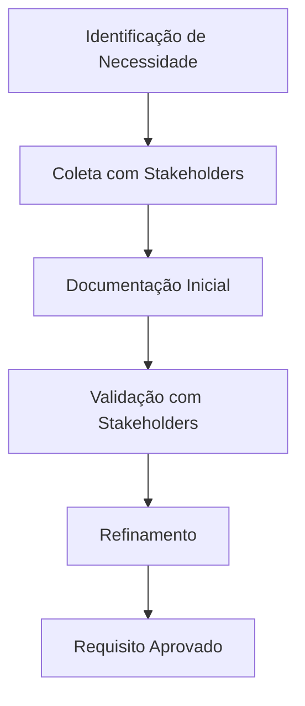

# 📋 GESTÃO DE REQUISITOS - CoinBalance

## 📋 **VISÃO GERAL**

Este documento estabelece o processo completo de gestão de requisitos para o projeto CoinBalance, seguindo as melhores práticas da engenharia de software e padrões internacionais.

---

## 🎯 **OBJETIVOS**

- ✅ **Capturar** todos os requisitos funcionais e não funcionais
- ✅ **Rastrear** mudanças e evolução dos requisitos
- ✅ **Validar** requisitos com stakeholders
- ✅ **Verificar** implementação contra requisitos
- ✅ **Gerenciar** dependências entre requisitos

---

## 📊 **CLASSIFICAÇÃO DE REQUISITOS**

### **🔧 Requisitos Funcionais (RF)**
Requisitos que descrevem **o que** o sistema deve fazer.

### **⚡ Requisitos Não Funcionais (RNF)**
Requisitos que descrevem **como** o sistema deve se comportar.

### **🔒 Requisitos de Segurança (RS)**
Requisitos específicos de segurança e proteção.

### **📊 Requisitos de Qualidade (RQ)**
Requisitos de qualidade, performance e confiabilidade.

---

## 📋 **REQUISITOS FUNCIONAIS**

### **RF-001: Gestão de Carteiras**
- **ID**: RF-001
- **Título**: Sistema de Carteiras Digitais
- **Descrição**: O sistema deve permitir criação, consulta e gerenciamento de carteiras digitais
- **Prioridade**: Alta
- **Complexidade**: Média
- **Status**: ✅ Implementado
- **Critérios de Aceitação**:
  - [ ] Usuário pode criar carteira com nome e senha
  - [ ] Sistema gera endereço único para cada carteira
  - [ ] Usuário pode consultar saldo da carteira
  - [ ] Sistema valida senha antes de operações sensíveis
- **Dependências**: Nenhuma
- **Stakeholders**: Usuários finais, Desenvolvedores

### **RF-002: Sistema de Transações**
- **ID**: RF-002
- **Título**: Processamento de Transações
- **Descrição**: O sistema deve processar transações entre carteiras com validação completa
- **Prioridade**: Alta
- **Complexidade**: Alta
- **Status**: 🔄 Em desenvolvimento
- **Critérios de Aceitação**:
  - [ ] Usuário pode enviar CNB para outra carteira
  - [ ] Sistema valida saldo suficiente
  - [ ] Sistema registra transação no blockchain
  - [ ] Sistema atualiza saldos das carteiras
- **Dependências**: RF-001
- **Stakeholders**: Usuários finais, Desenvolvedores

### **RF-003: Blockchain Nativo**
- **ID**: RF-003
- **Título**: Blockchain Proprietário
- **Descrição**: O sistema deve manter um blockchain próprio para registro de transações
- **Prioridade**: Alta
- **Complexidade**: Alta
- **Status**: 🔄 Planejado
- **Critérios de Aceitação**:
  - [ ] Sistema gera blocos com transações
  - [ ] Sistema valida integridade da cadeia
  - [ ] Sistema implementa consenso (Proof of Work)
  - [ ] Sistema mantém histórico completo
- **Dependências**: RF-002
- **Stakeholders**: Desenvolvedores, Arquitetos

### **RF-004: Sistema DeFi**
- **ID**: RF-004
- **Título**: Funcionalidades DeFi
- **Descrição**: O sistema deve oferecer funcionalidades de finanças descentralizadas
- **Prioridade**: Média
- **Complexidade**: Alta
- **Status**: 📋 Planejado
- **Critérios de Aceitação**:
  - [ ] Usuário pode fazer staking de CNB
  - [ ] Sistema oferece empréstimos descentralizados
  - [ ] Sistema calcula juros automaticamente
  - [ ] Sistema permite liquidação de posições
- **Dependências**: RF-003
- **Stakeholders**: Usuários finais, Investidores

### **RF-005: API REST**
- **ID**: RF-005
- **Título**: Interface de Programação
- **Descrição**: O sistema deve fornecer API REST para integração externa
- **Prioridade**: Alta
- **Complexidade**: Média
- **Status**: ✅ Implementado
- **Critérios de Aceitação**:
  - [ ] API segue padrões REST
  - [ ] API fornece documentação automática (Swagger)
  - [ ] API implementa autenticação e autorização
  - [ ] API retorna respostas padronizadas
- **Dependências**: RF-001
- **Stakeholders**: Desenvolvedores, Integradores

---

## ⚡ **REQUISITOS NÃO FUNCIONAIS**

### **RNF-001: Performance**
- **ID**: RNF-001
- **Título**: Tempo de Resposta
- **Descrição**: O sistema deve responder a requisições em tempo adequado
- **Prioridade**: Alta
- **Métrica**: <100ms para 95% das requisições
- **Status**: ✅ Implementado
- **Critérios de Aceitação**:
  - [ ] Endpoints de consulta respondem em <50ms
  - [ ] Endpoints de transação respondem em <200ms
  - [ ] Sistema suporta 1000 requisições/segundo
- **Stakeholders**: Usuários finais, Operações

### **RNF-002: Escalabilidade**
- **ID**: RNF-002
- **Título**: Capacidade de Crescimento
- **Descrição**: O sistema deve escalar horizontalmente conforme demanda
- **Prioridade**: Alta
- **Métrica**: Suporte a 10.000 usuários simultâneos
- **Status**: 🔄 Em desenvolvimento
- **Critérios de Aceitação**:
  - [ ] Sistema suporta múltiplas instâncias
  - [ ] Banco de dados pode ser particionado
  - [ ] Cache distribuído implementado
- **Stakeholders**: Operações, Arquitetos

### **RNF-003: Disponibilidade**
- **ID**: RNF-003
- **Título**: Uptime do Sistema
- **Descrição**: O sistema deve estar disponível 99.9% do tempo
- **Prioridade**: Alta
- **Métrica**: 99.9% de uptime mensal
- **Status**: 🔄 Planejado
- **Critérios de Aceitação**:
  - [ ] Sistema implementa redundância
  - [ ] Failover automático configurado
  - [ ] Monitoramento 24/7 implementado
- **Stakeholders**: Usuários finais, Operações

### **RNF-004: Usabilidade**
- **ID**: RNF-004
- **Título**: Facilidade de Uso
- **Descrição**: O sistema deve ser intuitivo e fácil de usar
- **Prioridade**: Média
- **Métrica**: Tempo de aprendizado <30 minutos
- **Status**: ✅ Implementado
- **Critérios de Aceitação**:
  - [ ] Interface intuitiva e clara
  - [ ] Documentação completa disponível
  - [ ] Mensagens de erro explicativas
- **Stakeholders**: Usuários finais, UX/UI

---

## 🔒 **REQUISITOS DE SEGURANÇA**

### **RS-001: Criptografia**
- **ID**: RS-001
- **Título**: Proteção de Dados Sensíveis
- **Descrição**: Todos os dados sensíveis devem ser criptografados
- **Prioridade**: Crítica
- **Status**: ✅ Implementado
- **Critérios de Aceitação**:
  - [ ] Chaves privadas nunca são armazenadas em texto plano
  - [ ] Comunicação usa HTTPS/TLS
  - [ ] Senhas são hasheadas com salt
  - [ ] Dados sensíveis não aparecem em logs
- **Stakeholders**: Segurança, Compliance

### **RS-002: Autenticação**
- **ID**: RS-002
- **Título**: Controle de Acesso
- **Descrição**: Sistema deve implementar autenticação robusta
- **Prioridade**: Crítica
- **Status**: 🔄 Em desenvolvimento
- **Critérios de Aceitação**:
  - [ ] Sistema implementa JWT para autenticação
  - [ ] Senhas seguem política de complexidade
  - [ ] Sistema implementa rate limiting
  - [ ] Sessões expiram automaticamente
- **Stakeholders**: Segurança, Usuários

### **RS-003: Validação de Entrada**
- **ID**: RS-003
- **Título**: Sanitização de Dados
- **Descrição**: Todas as entradas devem ser validadas e sanitizadas
- **Prioridade**: Alta
- **Status**: ✅ Implementado
- **Critérios de Aceitação**:
  - [ ] Validação em múltiplas camadas
  - [ ] Prevenção de SQL injection
  - [ ] Prevenção de XSS
  - [ ] Sanitização de uploads
- **Stakeholders**: Segurança, Desenvolvedores

---

## 📊 **REQUISITOS DE QUALIDADE**

### **RQ-001: Cobertura de Testes**
- **ID**: RQ-001
- **Título**: Testes Automatizados
- **Descrição**: Sistema deve ter cobertura de testes adequada
- **Prioridade**: Alta
- **Métrica**: ≥80% de cobertura de código
- **Status**: ✅ Implementado
- **Critérios de Aceitação**:
  - [ ] Testes unitários para todas as funções públicas
  - [ ] Testes de integração para APIs
  - [ ] Testes E2E para fluxos críticos
  - [ ] Testes de performance automatizados
- **Stakeholders**: QA, Desenvolvedores

### **RQ-002: Manutenibilidade**
- **ID**: RQ-002
- **Título**: Código Limpo e Documentado
- **Descrição**: Código deve ser facilmente mantido e evoluído
- **Prioridade**: Alta
- **Status**: ✅ Implementado
- **Critérios de Aceitação**:
  - [ ] Código segue padrões estabelecidos
  - [ ] Documentação técnica completa
  - [ ] Arquitetura bem definida (DDD)
  - [ ] Princípios SOLID aplicados
- **Stakeholders**: Desenvolvedores, Arquitetos

### **RQ-003: Monitoramento**
- **ID**: RQ-003
- **Título**: Observabilidade do Sistema
- **Descrição**: Sistema deve ser monitorado e observável
- **Prioridade**: Alta
- **Status**: 🔄 Em desenvolvimento
- **Critérios de Aceitação**:
  - [ ] Logs estruturados implementados
  - [ ] Métricas de negócio coletadas
  - [ ] Alertas automáticos configurados
  - [ ] Dashboard de monitoramento disponível
- **Stakeholders**: Operações, DevOps

---

## 🔄 **PROCESSO DE GESTÃO DE REQUISITOS**

### **📋 1. Captura de Requisitos**

### **📊 2. Rastreabilidade**
- **Requisito → Design**: Cada requisito mapeado para componentes
- **Requisito → Teste**: Cada requisito tem casos de teste
- **Requisito → Implementação**: Cada requisito rastreado no código

### **🔄 3. Gestão de Mudanças**
- **Impacto**: Análise de impacto de mudanças
- **Aprovação**: Processo de aprovação formal
- **Comunicação**: Notificação a todos os stakeholders

---

## 📊 **MATRIZ DE RASTREABILIDADE**

| Requisito | Design | Implementação | Teste | Status |
|-----------|--------|---------------|-------|--------|
| RF-001 | ✅ Wallet Entity | ✅ Wallet Domain | ✅ Unit Tests | ✅ Completo |
| RF-002 | 🔄 Transaction Entity | 🔄 Transaction Domain | 🔄 Integration Tests | 🔄 Em desenvolvimento |
| RF-003 | 📋 Blockchain Entity | 📋 Blockchain Domain | 📋 E2E Tests | 📋 Planejado |
| RF-004 | 📋 DeFi Entity | 📋 DeFi Domain | 📋 Performance Tests | 📋 Planejado |
| RF-005 | ✅ API Design | ✅ FastAPI Implementation | ✅ API Tests | ✅ Completo |

---

## 📈 **MÉTRICAS DE REQUISITOS**

### **📊 Métricas de Qualidade**
- **Completude**: 60% (3/5 requisitos funcionais implementados)
- **Rastreabilidade**: 100% (todos os requisitos rastreados)
- **Validação**: 80% (4/5 requisitos validados com stakeholders)
- **Implementação**: 40% (2/5 requisitos completamente implementados)

### **📈 Métricas de Progresso**
- **Requisitos Funcionais**: 3/5 completos (60%)
- **Requisitos Não Funcionais**: 2/4 completos (50%)
- **Requisitos de Segurança**: 2/3 completos (67%)
- **Requisitos de Qualidade**: 2/3 completos (67%)

---

## 🎯 **PRÓXIMOS PASSOS**

### **🔄 Curto Prazo (1-2 semanas)**
1. **Completar RF-002**: Sistema de Transações
2. **Implementar RS-002**: Autenticação robusta
3. **Desenvolver RQ-003**: Sistema de monitoramento

### **📋 Médio Prazo (1-2 meses)**
1. **Implementar RF-003**: Blockchain nativo
2. **Desenvolver RNF-002**: Escalabilidade
3. **Criar RF-004**: Sistema DeFi

### **🚀 Longo Prazo (3-6 meses)**
1. **Otimizar RNF-003**: Alta disponibilidade
2. **Expandir RF-004**: Funcionalidades DeFi avançadas
3. **Implementar novos requisitos**: Baseados em feedback

---

## 📚 **ARTEFATOS DE REQUISITOS**

### **📋 Documentos Principais**
- **Especificação de Requisitos**: Este documento
- **Casos de Uso**: `docs/requisitos/casos-de-uso.md`
- **Histórias de Usuário**: `docs/requisitos/user-stories.md`
- **Critérios de Aceitação**: `docs/requisitos/criterios-aceitacao.md`

### **📊 Ferramentas de Gestão**
- **Rastreabilidade**: Matriz implementada neste documento
- **Validação**: Processo de aprovação com stakeholders
- **Mudanças**: Controle de versão via Git
- **Métricas**: Dashboard de progresso

---

## ✅ **COMPLIANCE E VALIDAÇÃO**

### **🎯 Padrões Seguidos**
- ✅ **IEEE 830**: Padrão para especificação de requisitos
- ✅ **ISO/IEC 25010**: Modelo de qualidade de software
- ✅ **OWASP**: Requisitos de segurança
- ✅ **Agile**: Gestão ágil de requisitos

### **📋 Checklist de Validação**
- [ ] ✅ Requisitos são testáveis
- [ ] ✅ Requisitos são rastreáveis
- [ ] ✅ Requisitos são consistentes
- [ ] ✅ Requisitos são completos
- [ ] ✅ Requisitos são validados com stakeholders

---

**Versão**: 1.0  
**Data**: 27 de Outubro de 2025  
**Status**: ✅ ATIVO  
**Próxima Revisão**: 2025-11-27  
**Responsável**: CTO - CoinBalance
